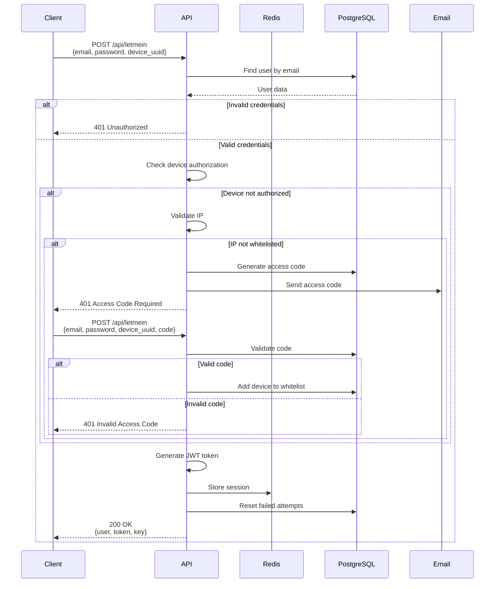

# WORM API

A production-ready Node.js API framework designed for internal developers building secure, scalable APIs with comprehensive authentication, role-based permissions, and JSON:API compliance.

## 🚀 Key Features

### 1. **Comprehensive Authentication System**
- Email/password authentication with JWT tokens
- Multi-factor device verification with access codes
- Progressive brute force protection (5min → 30min → account lockout)
- Password history tracking (prevents password reuse)
- Strong password requirements (15+ characters with complexity rules)
- Device authorization whitelist

### 2. **Role-Based Permission System**
- Configurable permission matrix per model and role
- Model-level access control (read/write/delete)
- Query-level data filtering with automatic constraints
- Automatic response filtering based on user permissions

### 3. **JSON:API Compliant CRUD Operations**
- Full JSON:API specification compliance for all generic endpoints
- Automatic relationship handling and side-loading
- Pagination, filtering, and sorting support
- Standardized error responses
- Resource relationships with nested data support

### 4. **Dual Storage Strategy**
- PostgreSQL for persistent data via Waterline ORM
- Redis for session/token caching and performance optimization
- Automatic connection pooling and management

### 5. **Enterprise Security Features**
- JWT session management with automatic token refresh
- AES-256-GCM encryption for sensitive data
- Device authorization tracking
- Helmet middleware for HTTP security headers
- Progressive lockout mechanism

### 6. **Flexible Deployment**
- Local development server ([`api/local.js`](api/local.js))
- AWS Lambda compatible ([`api/api.js`](api/api.js))
- Environment-specific configuration support

## 🛠️ Technology Stack

- **Runtime**: Node.js with Express 5.2.1
- **ORM**: Waterline (via water-orm 0.0.7)
- **Database**: PostgreSQL 12+
- **Caching**: Redis 6+ (ioredis 5.9.2)
- **Authentication**: JWT (jsonwebtoken 9.0.3)
- **Security**: Helmet 8.1.0, AES-256-GCM encryption
- **Configuration**: dotenv 17.2.4

## 📋 Prerequisites

Before installing, ensure you have the following:

- **Node.js** 16.x or higher
- **PostgreSQL** 12.x or higher
- **Redis** 6.x or higher
- **npm** or **yarn** package manager

## 📦 Installation

### 1. Clone the Repository

```bash
git clone <repository-url>
cd worm_api
```

### 2. Install Dependencies

```bash
npm install
```

### 3. Configure Environment Variables

Create environment-specific configuration files:

```bash
# For development
cp .env_dev .env

# For production
cp .env_prod .env
```

Edit the `.env` file with your configuration:

```env
# Environment
AUTH_STAGE=dev

# PostgreSQL Configuration
DB_ADDRESS=your-database-host.com
DB_ADDRESS_PRIVATE=your-private-database-host.com
DB_DBNAME=your_database_name
DB_USER=your_database_user
DB_PASSWORD=your_secure_password
DB_PORT=5432
DB_POOL_SIZE=10

# Optional: Redis Configuration (if using external Redis)
REDIS_HOST=localhost
REDIS_PORT=6379
REDIS_PASSWORD=your_redis_password
```

### 4. Initialize Database

Ensure PostgreSQL is running and the database specified in `DB_DBNAME` exists. The application will automatically create the necessary tables on first run.

### 5. Start the Server

```bash
# Development mode
npm run local

# Or with environment specification
npm run local dev

# Production mode
npm start
```

The server will start on port 8080 by default (configurable via `PORT` environment variable).

## ⚙️ Configuration Files

### [`config/constants.js`](config/constants.js)
Application-wide constants and settings:
```javascript
{
  TOKEN_EXPIRY_MINUTES: 60,
  FUNCTION_URL: 'https://your-lambda-function-url.com/<FunctionName>'
}
```

### [`config/database.js`](config/database.js)
Database connection configuration and Waterline adapter setup.

### [`config/permissions.js`](config/permissions.js)
Permission matrix defining role-based access control:
- `unauthenticatedRoutes`: Public routes that don't require authentication
- `defaultRules`: Default permissions for each role
- `rules`: Model-specific permission overrides
- `queryConstraints`: Data filtering rules based on user role

## 📁 Project Structure

```
worm_api/
├── api/
│   ├── api.js              # AWS Lambda entry point
│   └── local.js            # Local development server
├── config/
│   ├── constants.js        # Application constants
│   ├── database.js         # Database configuration
│   └── permissions.js      # Permission matrix
├── controllers/
│   ├── storage-db.js       # PostgreSQL operations
│   └── storage-redis.js    # Redis operations
├── models/
│   ├── index.js            # Model loader
│   └── db/                 # Database models
│       ├── users.js
│       ├── roles.js
│       ├── sessions.js
│       ├── authorization_codes.js
│       ├── password_history.js
│       └── permitted_devices.js
├── routers/
│   ├── generic.js          # Generic JSON:API CRUD router
│   ├── letmein.js          # Authentication endpoints
│   └── ping.js             # Health check
├── utils/
│   ├── util-auth.js               # Authentication logic
│   ├── util-session.js            # Session management
│   ├── util-encryption.js         # Encryption utilities
│   ├── util-permission-middleware.js  # Permission validation
│   └── util-database.js           # Database initialization
└── tests/                   # Test files
```

## 🌐 API Endpoints

All endpoints follow the JSON:API specification for consistent request/response formats.

### Authentication Endpoints

#### `POST /api/letmein` - Sign In
Authenticate a user and receive a JWT token.

**Request:**
```json
{
  "email": "user@example.com",
  "password": "SecurePassword123!@#",
  "device_uuid": "unique-device-identifier"
}
```

**Response (Success):**
```json
{
  "data": {
    "user": {
      "id": 1,
      "email": "user@example.com",
      "state": "active",
      "createdAt": "2024-01-01T00:00:00.000Z"
    },
    "token": "eyJhbGciOiJIUzI1NiIsInR5cCI6IkpXVCJ9...",
    "key": "session-key-for-refresh"
  }
}
```

**Response (Device Verification Required):**
```json
{
  "status": 401,
  "error": "Access Code Required"
}
```
*An access code will be sent to the user's email. Include it in the next request:*

```json
{
  "email": "user@example.com",
  "password": "SecurePassword123!@#",
  "device_uuid": "unique-device-identifier",
  "code": "XXXX-XXX-XXXX-B",
  "addDevice": true
}
```

#### `POST /api/letmein/signout` - Sign Out
Invalidate the current user session.

**Headers:**
```
x-access-token: <your-jwt-token>
```

### Generic CRUD Endpoints (JSON:API Compliant)

All generic endpoints follow the JSON:API specification for data formatting.

#### `GET /api/generic/:model` - Retrieve Records

**Example: Get all users**
```bash
GET /api/generic/users?limit=10&skip=0&sort={"createdAt":"DESC"}
```

**Response:**
```json
{
  "meta": {
    "totalrecords": 100,
    "query": {},
    "limit": 10,
    "skip": 0,
    "sort": {"createdAt": "DESC"}
  },
  "data": [
    {
      "type": "users",
      "id": 1,
      "attributes": {
        "email": "user@example.com",
        "state": "active",
        "createdAt": "2024-01-01T00:00:00.000Z",
        "updatedAt": "2024-01-01T00:00:00.000Z"
      },
      "relationships": {
        "role": {
          "data": { "type": "roles", "id": 2 }
        }
      }
    }
  ]
}
```

**Query Parameters:**
- `limit`: Number of records to return (default: 100)
- `skip`: Number of records to skip for pagination (default: 0)
- `sort`: Sorting criteria as JSON object `{"field": "ASC|DESC"}`
- `<field>`: Filter by any model field `?email=user@example.com`

#### `GET /api/generic/:model/:id` - Retrieve Single Record

**Example:**
```bash
GET /api/generic/users/1
```

**Response:**
```json
{
  "meta": {
    "totalrecords": 1,
    "query": {"id": 1},
    "limit": 100,
    "skip": 0
  },
  "data": {
    "type": "users",
    "id": 1,
    "attributes": {
      "email": "user@example.com",
      "state": "active"
    },
    "relationships": {
      "role": {
        "data": { "type": "roles", "id": 2 }
      }
    }
  }
}
```

#### `POST /api/generic/:model` - Create Record

**JSON:API Format Request:**
```json
{
  "data": {
    "type": "users",
    "attributes": {
      "email": "newuser@example.com",
      "password": "SecurePassword123!@#",
      "state": "active"
    },
    "relationships": {
      "role": {
        "data": { "type": "roles", "id": 2 }
      }
    }
  }
}
```

**Response:**
```json
{
  "data": {
    "type": "users",
    "id": 5,
    "attributes": {
      "email": "newuser@example.com",
      "state": "active"
    },
    "relationships": {
      "role": {
        "data": { "type": "roles", "id": 2 }
      }
    }
  }
}
```

**Bulk Creation (Array):**
```json
{
  "data": [
    {
      "type": "users",
      "attributes": { "email": "user1@example.com" }
    },
    {
      "type": "users",
      "attributes": { "email": "user2@example.com" }
    }
  ]
}
```

#### `PATCH /api/generic/:model/:id` - Update Record

**Request:**
```json
{
  "data": {
    "type": "users",
    "id": 1,
    "attributes": {
      "email": "updated@example.com"
    },
    "relationships": {
      "role": {
        "data": { "type": "roles", "id": 3 }
      }
    }
  }
}
```

**Response:**
```json
{
  "data": {
    "type": "users",
    "id": 1,
    "attributes": {
      "email": "updated@example.com",
      "id": 1
    },
    "relationships": {
      "role": {
        "data": { "type": "roles", "id": 3 }
      }
    }
  }
}
```

#### `DELETE /api/generic/:model/:id` - Delete Record

**Request:**
```bash
DELETE /api/generic/users/1
```

**Response:**
```json
{
  "meta": {
    "success": true
  }
}
```

#### `GET /api/ping` - Health Check

**Response:**
```json
{
  "status": "ok",
  "timestamp": "2024-01-01T00:00:00.000Z"
}
```

## 🔐 Authentication Flow



## 🔒 Security Features

### Password Requirements
- Minimum 15 characters
- At least 2 uppercase letters
- At least 2 lowercase letters
- At least 2 numbers
- At least 2 special characters

### Brute Force Protection
- **3 failed attempts**: 5-minute lockout
- **6 failed attempts**: 30-minute lockout
- **9 failed attempts**: Account deactivation (requires admin intervention)

### Password History
- Tracks previous passwords to prevent reuse
- Configurable lookback period
- Passwords are hashed and salted before storage

### Device Authorization
- Unknown devices require verification code
- Access codes sent via email
- Optional device whitelisting
- IP-based validation

### Encryption
- **AES-256-GCM** for sensitive data at rest
- **SHA-256** for password hashing
- Per-user salt generation based on creation timestamp
- JWT tokens for session management

### Session Management
- Automatic token refresh before expiry
- Configurable token expiration (default: 60 minutes)
- Redis-based session storage for fast validation
- Secure session invalidation on logout

## 📝 Adding New Models

### 1. Create Model Definition

Create a new file in [`models/db/`](models/db/) (e.g., `invoices.js`):

```javascript
module.exports = function() {
  return {
    identity: 'invoices',
    datastore: 'default',
    primaryKey: 'id',
    
    attributes: {
      id: {
        type: 'number',
        autoIncrement: true
      },
      invoice_number: {
        type: 'string',
        required: true,
        unique: true
      },
      amount: {
        type: 'number',
        required: true
      },
      status: {
        type: 'string',
        isIn: ['pending', 'paid', 'cancelled'],
        defaultsTo: 'pending'
      },
      user: {
        model: 'users',
        required: true
      },
      createdAt: {
        type: 'number',
        autoCreatedAt: true
      },
      updatedAt: {
        type: 'number',
        autoUpdatedAt: true
      }
    },
    
    // Optional: Define custom permissions for this model
    permissions: {
      admin: ['read', 'write', 'delete'],
      user: ['read', 'write']
    }
  };
};
```

### 2. Configure Permissions (Optional)

In [`config/permissions.js`](config/permissions.js), add custom rules if needed:

```javascript
const rules = {
  invoices: {
    admin: ['read', 'write', 'delete'],
    user: ['read'], // Users can only read their own invoices
    accountant: ['read', 'write']
  }
};

const queryConstraints = {
  user: {
    invoices: ['user', 'id'] // Users see only their own invoices
  },
  accountant: {
    // Accountants can see all invoices
  }
};
```

### 3. Use the New Model

Once defined, the model is automatically available through generic endpoints:

```bash
# Get all invoices (with permission filtering)
GET /api/generic/invoices

# Create an invoice
POST /api/generic/invoices
Content-Type: application/json

{
  "data": {
    "type": "invoices",
    "attributes": {
      "invoice_number": "INV-2024-001",
      "amount": 1500.00,
      "status": "pending"
    },
    "relationships": {
      "user": {
        "data": { "type": "users", "id": 1 }
      }
    }
  }
}
```

## 🎯 JSON:API Compliance Details

This framework strictly follows the [JSON:API specification](https://jsonapi.org/) for all generic CRUD operations:

### Resource Objects
Every resource object includes:
- `type`: The resource type (model name in plural form)
- `id`: The unique identifier
- `attributes`: Data fields
- `relationships`: Related resources with their type and id

### Relationship Handling
The framework automatically:
- **Flattens relationships** on write operations (converts JSON:API format to Waterline format)
- **Expands relationships** on read operations (converts Waterline format to JSON:API format)
- **Handles nested creation**: Create related resources inline if they don't have an ID
- **Supports both singular and collection relationships**

### Example: Complex Relationship
```json
{
  "data": {
    "type": "orders",
    "attributes": {
      "order_number": "ORD-001",
      "total": 500.00
    },
    "relationships": {
      "customer": {
        "data": { "type": "users", "id": 1 }
      },
      "items": {
        "data": [
          { "type": "products", "id": 10 },
          { "type": "products", "id": 15 }
        ]
      }
    }
  }
}
```

### Pagination & Filtering
Standard query parameters supported:
- `limit` & `skip` for pagination
- `sort` for ordering results
- Any model attribute for filtering
- Automatic metadata in responses (`meta.totalrecords`, `meta.query`, etc.)

### Error Responses
All errors follow JSON:API error format:
```json
{
  "status": 401,
  "error": "Invalid Username or Password"
}
```

## 🚀 Deployment

### Local Development

The local server ([`api/local.js`](api/local.js)) provides:
- Hot-reloading support
- Environment-specific configurations
- CORS enabled for frontend development
- Detailed error logging
- Test mode support

```bash
# Start with specific environment
npm run local dev

# Start with test environment
npm run local test
```

### AWS Lambda Deployment

The Lambda handler ([`api/api.js`](api/api.js)) is pre-configured for serverless deployment:

1. **Package the application:**
```bash
zip -r worm-api.zip . -x "*.git*" "node_modules/*" "tests/*"
npm install --production
zip -r worm-api.zip node_modules
```

2. **Configure Lambda:**
   - Runtime: Node.js 16.x or higher
   - Handler: `api/api.handler`
   - Memory: 512 MB (minimum)
   - Timeout: 30 seconds
   - Environment variables: Set all variables from `.env`

3. **Set up API Gateway:**
   - Create REST API
   - Configure proxy integration to Lambda
   - Enable CORS if needed
   - Deploy to stage

### Environment-Specific Configuration

The application automatically loads the correct environment file:

```bash
# Development
.env_dev → .env

# Production
.env_prod → .env

# Test
.env_test → .env
```

Create environment-specific files as needed:
```bash
.env_dev      # Development settings
.env_prod     # Production settings
.env_staging  # Staging settings
```

## 🧪 Testing

```bash
# Run all tests
npm test

# Run with coverage
npm run coverage
```

Tests are located in the [`tests/`](tests/) directory.

## 📚 Additional Documentation

Detailed documentation for specific features can be found in the `docs/` directory:
- Authentication & Authorization Guide
- Database Schema Reference
- API Integration Examples
- Security Best Practices
- Deployment Guide

## 🤝 Contributing

This is an internal framework. For contributions or questions, please contact the development team.

## 📄 License

**UNLICENSED** - Proprietary software for internal use only.

## 👥 Author

Carlos Galveias

---

## 🔧 Quick Reference

### Start the Server
```bash
npm run local
```

### Create a New User
```bash
curl -X POST http://localhost:8080/api/generic/users \
  -H "Content-Type: application/json" \
  -d '{
    "data": {
      "type": "users",
      "attributes": {
        "email": "user@example.com",
        "password": "SecurePassword123!@#",
        "state": "active"
      }
    }
  }'
```

### Sign In
```bash
curl -X POST http://localhost:8080/api/letmein \
  -H "Content-Type: application/json" \
  -d '{
    "email": "user@example.com",
    "password": "SecurePassword123!@#",
    "device_uuid": "my-device-123"
  }'
```

### Access Protected Endpoint
```bash
curl -X GET http://localhost:8080/api/generic/users/1 \
  -H "x-access-token: YOUR_JWT_TOKEN"
```

---

**Happy Coding! 🚀**