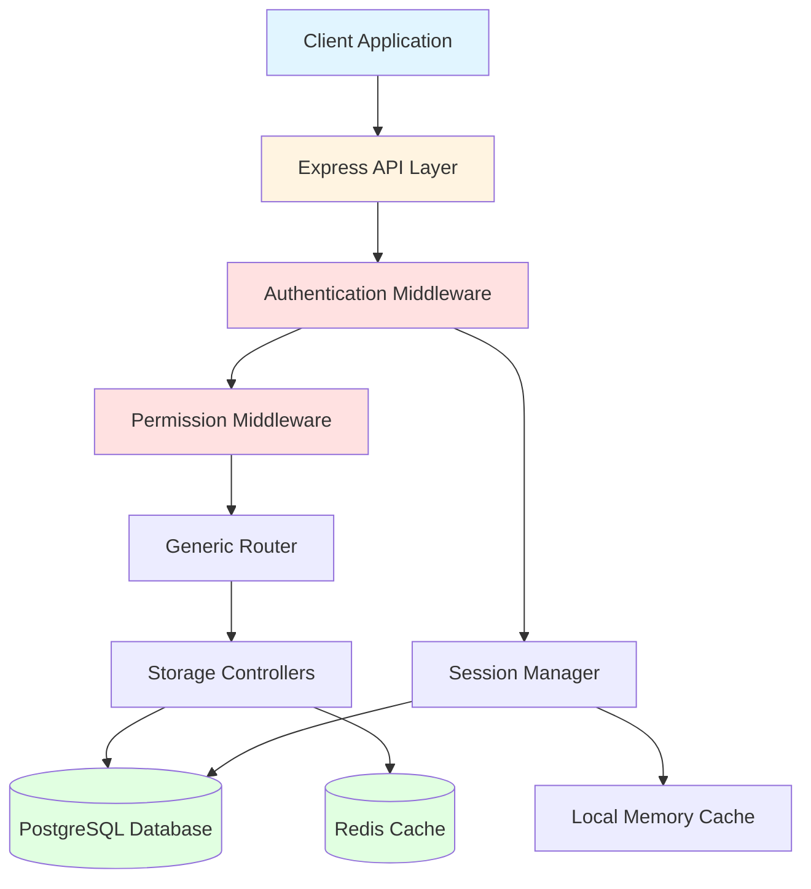
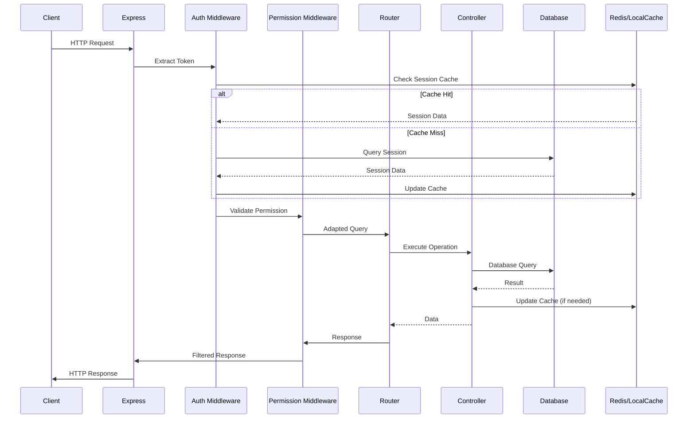
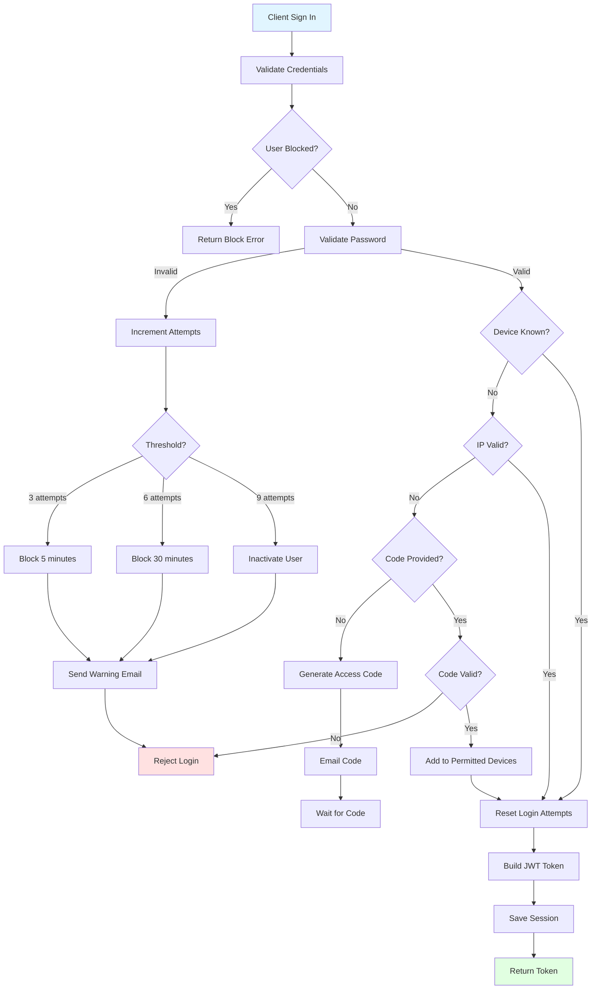
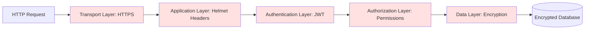
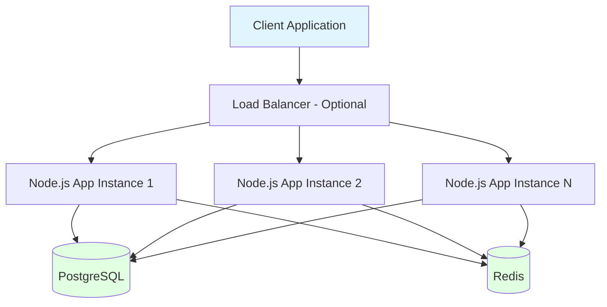
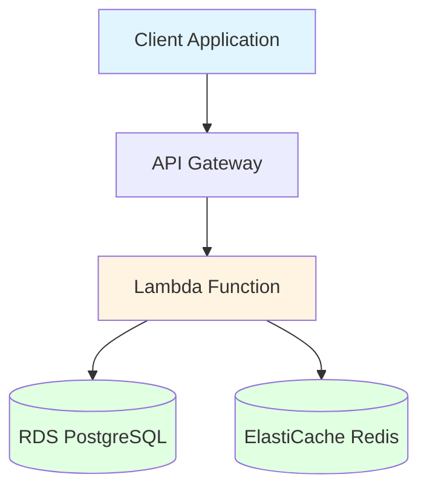

# ARCHITECTURE

## System Overview

The WORM API is a Node.js-based REST API framework designed with security, scalability, and maintainability as core principles. It implements a layered architecture with comprehensive authentication, role-based access control, and dual storage strategies.

### High-Level Architecture



### Key Characteristics

- **Security-First Design**: Multi-layer security with encryption, authentication, and authorization
- **Scalable Architecture**: Supports both local deployment and AWS Lambda serverless
- **Dual Storage Strategy**: PostgreSQL for persistence, Redis for caching, LocalCache for sessions
- **Generic CRUD Operations**: Reusable patterns for resource management
- **JSON:API Compliance**: Standardized API responses and error handling

---

## Layered Architecture

The application follows a strict layered architecture pattern to ensure separation of concerns and maintainability.

### Layer 1: API Entry Point

**Files**: [`api/api.js`](api/api.js:1), [`api/local.js`](api/local.js:1)

- Express server initialization
- Middleware configuration (Helmet, CORS, body-parser)
- Route registration
- Error handling setup
- Lambda adapter for serverless deployment

### Layer 2: Router Layer

**Files**: [`routers/generic.js`](routers/generic.js:1), [`routers/letmein.js`](routers/letmein.js:1), [`routers/ping.js`](routers/ping.js:1)

- Route definitions and HTTP method handlers
- Request validation
- Response formatting
- Generic CRUD operations for all models
- Authentication endpoints
- Health check endpoints

### Layer 3: Middleware Layer

**Files**: [`utils/util-permission-middleware.js`](utils/util-permission-middleware.js:1)

- JWT token validation
- Session verification (cache → database)
- Permission checking against configuration
- Query adaptation based on user role
- Response filtering for sensitive data
- Whitelist management for public routes

### Layer 4: Controller Layer

**Files**: [`controllers/storage-db.js`](controllers/storage-db.js:1), [`controllers/storage-redis.js`](controllers/storage-redis.js:1)

- Database operations (CRUD)
- Redis cache operations
- Data transformation
- Transaction management
- Connection pooling

### Layer 5: Model Layer

**Files**: [`models/db/*.js`](models/db/)

- Data schema definitions using Waterline ORM
- Model relationships (foreign keys, associations)
- Validation rules
- Model-level permissions
- Index definitions

### Layer 6: Utility Layer

**Files**: [`utils/*.js`](utils/)

- Authentication logic ([`util-auth.js`](utils/util-auth.js:1))
- Session management ([`util-session.js`](utils/util-session.js:1))
- Encryption services ([`util-encryption.js`](utils/util-encryption.js:1))
- Database utilities ([`util-database.js`](utils/util-database.js:1))
- Local caching ([`util-localCache.js`](utils/util-localCache.js:1))
- System utilities ([`util-system.js`](utils/util-system.js:1))

---

## Technology Stack

### Core Technologies

| Technology | Version | Purpose |
|------------|---------|---------|
| **Node.js** | 14+ | Runtime environment |
| **Express** | 4.x | Web framework |
| **Waterline ORM** | 0.13.x | Database abstraction layer |
| **PostgreSQL** | 12+ | Primary database |
| **Redis** | 6+ | Caching layer |

### Security Libraries

| Library | Purpose |
|---------|---------|
| **crypto** (Node.js) | AES-256-GCM encryption, SHA-256 hashing, Scrypt key derivation |
| **jsonwebtoken** | JWT token generation and validation |
| **helmet** | HTTP security headers |

### Middleware & Utilities

| Library | Purpose |
|---------|---------|
| **body-parser** | Request body parsing |
| **cors** | Cross-origin resource sharing |
| **aws-serverless-express** | Lambda deployment adapter |

---

## Design Patterns

### 1. Adapter Pattern

**Location**: [`api/api.js`](api/api.js:1)

The API layer provides adapters for both local Express server and AWS Lambda environments, allowing the same codebase to run in different deployment scenarios.

```javascript
// Local adapter
const server = app.listen(port);

// Lambda adapter
exports.handler = awsServerlessExpress.createServer(app);
```

### 2. Middleware Chain Pattern

**Location**: [`utils/util-permission-middleware.js`](utils/util-permission-middleware.js:1)

Request processing flows through a chain of middleware functions:
1. Token extraction
2. Token validation
3. Session verification
4. Permission checking
5. Query adaptation
6. Handler execution
7. Response filtering

### 3. Repository Pattern

**Location**: [`controllers/storage-db.js`](controllers/storage-db.js:1), [`controllers/storage-redis.js`](controllers/storage-redis.js:1)

Data access is abstracted through storage controllers, providing a clean interface for database operations and allowing easy switching between storage implementations.

### 4. Factory Pattern

**Location**: [`models/index.js`](models/index.js:1)

Models are dynamically loaded and initialized based on configuration, allowing flexible model registration.

### 5. Singleton Pattern

**Location**: [`utils/util-localCache.js`](utils/util-localCache.js:1)

The LocalCache implements a singleton pattern to maintain a single in-memory cache instance across the application.

### 6. Strategy Pattern

**Location**: [`utils/util-encryption.js`](utils/util-encryption.js:1)

Different encryption strategies (AES-256-GCM, SHA-256) are implemented as interchangeable algorithms.

---

## Component Interactions

### Request Flow



### Authentication Flow



---

## Data Flow

### Write Operation Flow

1. **Client Request** → JSON payload with data
2. **Authentication** → Token validation
3. **Permission Check** → Verify write permission
4. **Router** → Parse and validate data
5. **Controller** → Transform data for database
6. **Database** → Insert/Update operation
7. **Cache Invalidation** → Clear relevant cache entries
8. **Response** → Return created/updated resource

### Read Operation Flow

1. **Client Request** → Query parameters
2. **Authentication** → Token validation
3. **Permission Check** → Verify read permission
4. **Query Adaptation** → Apply role-based filters
5. **Cache Check** → Look for cached results
6. **Database Query** → Fetch data if cache miss
7. **Cache Update** → Store results in cache
8. **Response Filtering** → Remove sensitive fields
9. **Response** → Return filtered data

---

## Security Architecture

### Multi-Layer Security Approach



### Security Layers

1. **Transport Security**: HTTPS/TLS encryption
2. **HTTP Security Headers**: Helmet middleware (XSS, CSRF protection)
3. **Authentication**: JWT tokens with expiry
4. **Authorization**: Role-based access control with query filtering
5. **Data Encryption**: AES-256-GCM for sensitive data
6. **Password Security**: SHA-256 hashing with user-specific salts
7. **Brute Force Protection**: Progressive lockout mechanism
8. **Device Verification**: Unknown device detection and authorization
9. **Session Management**: Token expiry and refresh mechanisms
10. **Password History**: Prevents password reuse

See [`SECURITY.md`](SECURITY.md) for detailed security documentation.

---

## Deployment Architecture

### Local Deployment



**Characteristics**:
- Multiple Node.js instances for high availability
- Shared PostgreSQL database
- Shared Redis cache
- Load balancer for request distribution
- Environment variables from `.env` file

**Setup**:
```bash
# Install dependencies
npm install

# Configure environment
cp .env_dev .env
# Edit .env with your database credentials

# Start server
npm start
# or
node api/local.js
```

### AWS Lambda Deployment



**Characteristics**:
- Serverless execution
- Auto-scaling
- Pay-per-execution pricing
- API Gateway for HTTP routing
- RDS for managed PostgreSQL
- ElastiCache for managed Redis
- Environment variables from Lambda configuration

**Configuration**: [`config/constants.js`](config/constants.js:1)
```javascript
FUNCTION_URL: 'https://mylambdafunction.whatever/<FunctionName>'
```

### Deployment Considerations

| Aspect | Local Deployment | Lambda Deployment |
|--------|------------------|-------------------|
| **Cost** | Fixed infrastructure cost | Pay-per-execution |
| **Scaling** | Manual horizontal scaling | Automatic scaling |
| **Cold Start** | None | 100-500ms initial latency |
| **Stateful** | Can maintain state | Stateless (use external cache) |
| **Database Connections** | Connection pooling | Limited concurrent connections |
| **Best For** | High sustained traffic | Variable/bursty traffic |

---

## Performance Optimization

### Caching Strategy

**Three-Tier Caching**:

1. **LocalCache** ([`util-localCache.js`](utils/util-localCache.js:1))
   - In-memory cache for session data
   - Fastest access (microseconds)
   - Limited to single instance

2. **Redis Cache** ([`storage-redis.js`](controllers/storage-redis.js:1))
   - Distributed cache for shared data
   - Fast access (milliseconds)
   - Shared across instances

3. **Database** (PostgreSQL)
   - Persistent storage
   - Indexed queries
   - Connection pooling

### Query Optimization

- **Indexed Fields**: All foreign keys and frequently queried fields have indexes
- **Limit Clauses**: Default pagination to prevent large result sets
- **Selective Population**: Only populate relationships when needed
- **Query Adaptation**: Permission middleware adds filters at query level (more efficient than post-filtering)

### Connection Management

- **Database Connection Pool**: Configurable pool size in [`config/database.js`](config/database.js:1)
- **Redis Connection**: Persistent connection with automatic reconnection
- **Session Reuse**: JWT tokens reduce database queries for authentication

---

## Extensibility

### Adding New Models

1. Create model definition in [`models/db/`](models/db/)
2. Define schema with Waterline syntax
3. Configure permissions in model
4. Model automatically registered via [`models/index.js`](models/index.js:1)
5. Generic CRUD endpoints automatically available at `/generic/:modelname`

See [`DATABASE.md`](DATABASE.md) for detailed instructions.

### Adding Custom Routes

1. Create router file in [`routers/`](routers/)
2. Implement handler functions
3. Register route in [`api/api.js`](api/api.js:1)
4. Configure permissions in