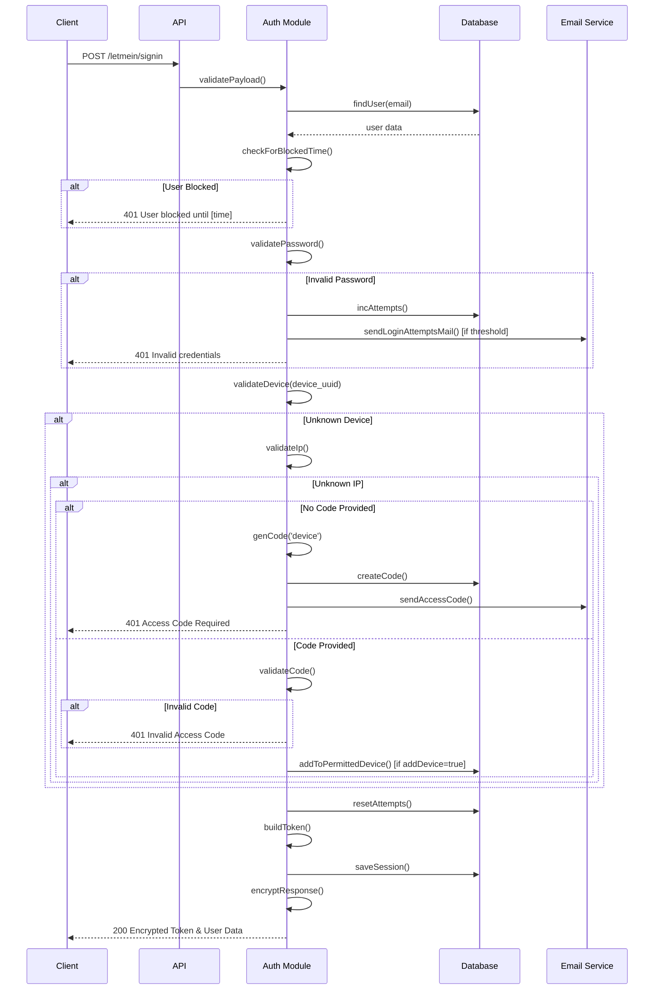
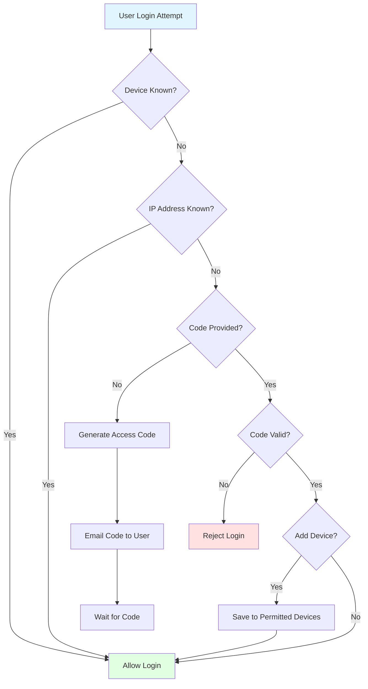
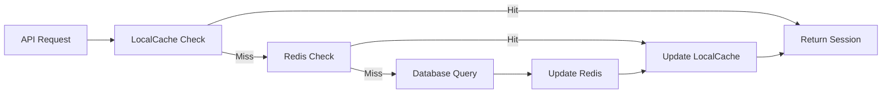
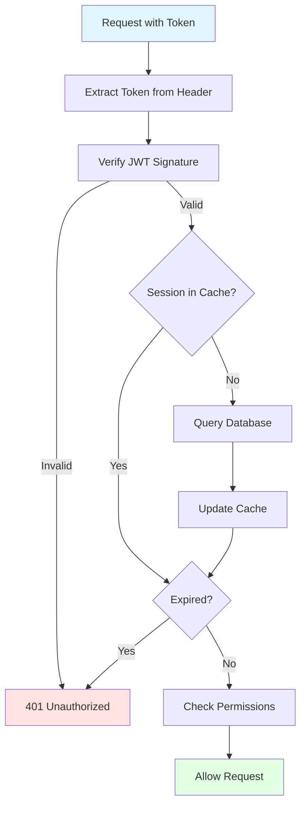

# AUTHENTICATION

## Overview

The WORM API implements a comprehensive multi-layer authentication system featuring JWT tokens, device verification, brute force protection, password security, and session management. The system is designed to balance security with user experience.

**Key Features**:
- JWT-based token authentication
- Device verification for unknown devices
- Progressive brute force protection
- Password complexity enforcement
- Password history tracking
- User-specific password salting
- Session management with caching
- Automatic session cleanup

---

## Authentication Flow

### Complete Sign-In Process



---

## Password Security

### Password Requirements

**Implementation**: [`utils/util-auth.js`](utils/util-auth.js:12)

The system enforces strict password complexity rules:

```javascript
const passwordRules = {
  minLength: 15,
  minUppercase: 2,
  minLowercase: 2,
  minNumbers: 2,
  minSpecialChars: 2,
  allowedSpecialChars: [
    '~', '`', '!', '@', '#', '$', '€', '%', '^', '&', 
    '*', '(', ')', '-', '_', '+', '=', '{', '}', '[', 
    ']', '|', '\\', '/', ':', ';', '"', "'", '<', '>', 
    ',', '.', '?'
  ]
};
```

**Valid Password Examples**:
- `MySecurePass123!@#`
- `C0mpl3x&P@ssw0rd!!`
- `Str0ng_Passw0rd#2024`

**Invalid Password Examples**:
- `Short123!` (too short)
- `NoNumbersHere!@#` (missing numbers)
- `no-uppercase-123` (missing uppercase)
- `NO-LOWERCASE-123!` (missing lowercase)

### Password Hashing

**Two-Layer Hashing Process**:

1. **SHA-256 Hash**: Convert plain password to hash
2. **User-Specific Salt**: Encrypt hash with user's unique salt

```javascript
// Step 1: Hash password with SHA-256
const passwordHash = await sha256_hash(plainPassword);

// Step 2: Salt with user-specific key
const saltedPassword = await salt(userId, userCreatedAt, passwordHash);
```

### User-Specific Salt Generation

**Implementation**: [`utils/util-auth.js`](utils/util-auth.js:43)

Each user has a unique salt derived from their ID and creation timestamp:

```javascript
async function salt(userId, createdAt, data) {
  const date = +new Date(createdAt);           // User's creation timestamp
  const multiplier = Math.pow(userId, 69);      // Unique per user
  const sqr = '' + Math.sqrt(multiplier * date); // Combined value
  const key = await sha256_hash(sqr);           // Derive encryption key
  
  // Encrypt password with AES-256-GCM
  const encrypted = await aes_256_gcm_encrypt(key, data);
  return encrypted; // Returns {encrypted, iv, salt, authTag}
}
```

**Why This Approach**:
- Each user has a unique salt (even with same password)
- Salt cannot be changed without knowing user's creation time
- Prevents rainbow table attacks
- Makes bulk password cracking impractical

### Password History Tracking

**Implementation**: [`utils/util-auth.js`](utils/util-auth.js:335)

The system prevents password reuse by tracking history:

```javascript
async function validateNewPasswordHistory(userId, newPassword, lookback = 5) {
  // Get user's salted password history
  const history = await db.password_history.find({
    user_id: userId
  })
  .sort('createdAt DESC')
  .limit(lookback);
  
  // Salt new password with user's key
  const saltedNewPassword = await salt(userId, createdAt, newPassword);
  
  // Check if password was used before
  for (const record of history) {
    if (record.password === saltedNewPassword) {
      return false; // Password was used recently
    }
  }
  
  return true; // Password is acceptable
}
```

**Configuration**:
- Default lookback: 5 passwords
- Configurable per password change request
- Stored in [`password_history`](models/db/password_history.js:1) table

### Password Change Process

**Endpoint**: `POST /letmein/change-password`

**Implementation**: [`utils/util-auth.js`](utils/util-auth.js:368)

```javascript
async function changePassword(userId, newPassword) {
  // 1. Get user
  const user = await getUserFromId(userId);
  
  // 2. Validate password rules
  if (!validatePasswordRules(newPassword)) {
    throw new Error('Password does not meet requirements');
  }
  
  // 3. Check password history
  const isUnique = await validateNewPasswordHistory(userId, newPassword, 5);
  if (!isUnique) {
    throw new Error('Password was used recently');
  }
  
  // 4. Hash and salt password
  const passwordHash = await sha256_hash(newPassword);
  const saltedPassword = await salt(userId, user.createdAt, passwordHash);
  
  // 5. Update user password
  await db.users.update({ id: userId }, {
    password: saltedPassword,
    attempts: 0,
    lastattempt: null
  });
  
  // 6. Save to password history
  await db.password_history.create({
    user_id: userId,
    password: saltedPassword
  });
}
```

---

## Device Verification

### Device Recognition Flow



### Device UUID

**Format**: Standard UUID v4  
**Example**: `550e8400-e29b-41d4-a716-446655440000`

**Client Generation**:
```javascript
// Browser
const deviceUuid = crypto.randomUUID();

// Node.js
const crypto = require('crypto');
const deviceUuid = crypto.randomUUID();

// Store persistently
localStorage.setItem('device_uuid', deviceUuid);
```

### Access Code Generation

**Implementation**: [`utils/util-auth.js`](utils/util-auth.js:229)

```javascript
function genCode(type) {
  let mask;
  if (type === 'password') {
    mask = 'xxxx-xxx-xxxx-a';  // Ends with 'A'
  } else if (type === 'device') {
    mask = 'xxxx-xxx-xxxx-b';  // Ends with 'B'
  }
  
  // Replace x with random hex digits
  mask = mask.replace(/[xy]/g, (c) => {
    const r = (Math.random() * 16) | 0;
    return r.toString(16);
  });
  
  return mask.toUpperCase();
}
```

**Code Examples**:
- Device: `A3F2-D4E-B1C9-B`
- Password: `7E9F-2C4-D8A6-A`

**Code Properties**:
- Expiry: 5 minutes (default)
- Single use
- Type-specific suffix for validation
- Stored in [`authorization_codes`](models/db/authorization_codes.js:1) table

### Device Whitelisting

**Implementation**: [`utils/util-auth.js`](utils/util-auth.js:525)

Users can optionally whitelist a device during code verification:

```javascript
// Sign-in request with code
{
  "email": "user@example.com",
  "password": "SecurePassword123!@#",
  "device_uuid": "550e8400-e29b-41d4-a716-446655440000",
  "code": "A3F2-D4E-B1C9-B",
  "addDevice": true  // Whitelist this device
}
```

When `addDevice: true`:
```javascript
await db.permitted_devices.create({
  user: userId,
  device: deviceUuid
});
```

**Benefits**:
- User won't need codes on this device again
- Convenient for trusted devices
- Optional for temporary/public devices

---

## Brute Force Protection

### Progressive Lockout System

**Implementation**: [`utils/util-auth.js`](utils/util-auth.js:7)

The system implements three-tier progressive lockout:

```javascript
const ATTEMPTS_5MIN_BLOCK = 3;   // 5-minute lockout
const ATTEMPTS_30MIN_BLOCK = 6;  // 30-minute lockout
const ATTEMPTS_INACTIVATE = 9;   // Permanent inactivation
```

### Lockout Stages

#### Stage 1: 5-Minute Lockout (3 attempts)

```javascript
if (attempts >= 3 && attempts < 6) {
  const lockoutUntil = new Date(lastAttempt.getTime() + 5 * 60 * 1000);
  if (now < lockoutUntil) {
    return 'User blocked until ' + lockoutUntil.toISOString();
  }
}
```

**User Experience**:
- 3rd failed attempt triggers lockout
- User receives email warning
- Must wait 5 minutes before retry
- Attempts counter preserved

#### Stage 2: 30-Minute Lockout (6 attempts)

```javascript
if (attempts >= 6 && attempts < 9) {
  const lockoutUntil = new Date(lastAttempt.getTime() + 30 * 60 * 1000);
  if (now < lockoutUntil) {
    return 'User blocked until ' + lockoutUntil.toISOString();
  }
}
```

**User Experience**:
- 6th failed attempt triggers longer lockout
- More urgent email warning
- Must wait 30 minutes before retry
- Last chance before inactivation

#### Stage 3: Account Inactivation (9 attempts)

```javascript
if (attempts >= 9) {
  await db.users.update({ id: userId }, { 
    state: 'inactive',
    attempts: 9
  });
  await sendUserInactiveEmail(user);
}
```

**User Experience**:
- 9th failed attempt permanently inactivates account
- User receives inactivation email
- Must contact administrator for reactivation
- Prevents automated attacks

### Attempt Tracking

**Increment Attempts**: [`utils/util-auth.js`](utils/util-auth.js:151)

```javascript
async function incAttempts(user) {
  const attempts = user.attempts + 1;
  const lastattempt = new Date();
  
  await db.users.update({ id: user.id }, {
    attempts: attempts,
    lastattempt: lastattempt,
    state: attempts === 9 ? 'inactive' : user.state
  });
  
  // Send email at thresholds
  if ([3, 6, 9].includes(attempts)) {
    await sendLoginAttemptsMail(user, attempts, req);
  }
  
  return attempts;
}
```

**Reset Attempts**: [`utils/util-auth.js`](utils/util-auth.js:113)

```javascript
async function resetAttempts(user) {
  await db.users.update({ id: user.id }, {
    attempts: 0,
    lastattempt: null
  });
}
```

**When Attempts Reset**:
- Successful login
- Successful password change
- Manual administrator reset

### Email Notifications

**Implementation**: [`utils/util-auth.js`](utils/util-auth.js:440)

```javascript
async function sendLoginAttemptsMail(user, attempts, req) {
  const subject = `Security Alert: ${attempts} Failed Login Attempts`;
  const content = `
    Someone with IP Address: ${req.originip} 
    is trying to login with your account 
    for the ${attempts} time!
    
    ${attempts === 3 ? 'Account locked for 5 minutes.' : ''}
    ${attempts === 6 ? 'Account locked for 30 minutes.' : ''}
    ${attempts === 9 ? 'Account has been inactivated. Contact support.' : ''}
  `;
  
  // TODO: Implement actual email sending
  await sendEmail(user.email, subject, content);
}
```

---

## Session Management

### JWT Token Structure

**Implementation**: [`utils/util-session.js`](utils/util-session.js:1)

```javascript
const tokenPayload = {
  id: user.id,
  email: user.email,
  roles: user.roles,
  type: 'user',  // or 'worker', 'api', etc.
  iat: Math.floor(Date.now() / 1000),
  exp: Math.floor(Date.now() / 1000) + (60 * 60) // 1 hour
};

const token = jwt.sign(tokenPayload, JWT_SECRET);
```

**Token Types**:
- `user`: Standard user sessions
- `worker`: Background job workers
- `api`: API-to-API communication
- `admin`: Administrative operations

### Token Expiry

**Configuration**: [`config/constants.js`](config/constants.js:2)

```javascript
TOKEN_EXPIRY_MINUTES: 60  // Default: 1 hour
```

**Token Lifecycle**:
1. Generated during successful sign-in
2. Stored in database and cache
3. Validated on each request
4. Expires after configured time
5. Must be refreshed or user re-authenticates

### Session Storage Strategy

**Three-Tier Caching**:



#### Tier 1: LocalCache

**Implementation**: [`utils/util-localCache.js`](utils/util-localCache.js:1)

```javascript
// In-memory cache (fastest)
const LocalCache = {
  cache: new Map(),
  
  get(key) {
    return this.cache.get(key);
  },
  
  set(key, value, ttl) {
    this.cache.set(key, value);
    // Auto-expire after TTL
    setTimeout(() => this.cache.delete(key), ttl * 1000);
  }
};
```

**Characteristics**:
- Access time: < 1ms
- Scope: Single process
- Best for: High-frequency reads

#### Tier 2: Redis Cache

**Implementation**: [`controllers/storage-redis.js`](controllers/storage-redis.js:1)

```javascript
// Distributed cache (fast)
await redis.set(`session_${userId}`, JSON.stringify(session), 'EX', 3600);
const session = await redis.get(`session_${userId}`);
```

**Characteristics**:
- Access time: 1-5ms
- Scope: All instances
- Best for: Shared state

#### Tier 3: Database

**Implementation**: [`models/db/sessions.js`](models/db/sessions.js:1)

```javascript
// Persistent storage (reliable)
const session = await db.sessions.findOne({
  user: userId,
  token_expiry_date: { '>': new Date() }
});
```

**Characteristics**:
- Access time: 10-50ms
- Scope: Persistent
- Best for: Source of truth

### Building a Session

**Implementation**: [`utils/util-session.js`](utils/util-session.js:1)

async function buildToken(user) {
  // 1. Create JWT payload
  const payload = {
    id: user.id,
    email: user.email,
    roles: user.roles,
    type: 'user',
    iat: Math.floor(Date.now() / 1000)
  };
  
  // 2. Sign token
  const token = jwt.sign(payload, JWT_SECRET, {
    expiresIn: `${TOKEN_EXPIRY_MINUTES}m`
  });
  
  // 3. Calculate expiry
  const expiryDate = new Date(Date.now() + TOKEN_EXPIRY_MINUTES * 60 * 1000);
  
  // 4. Save to database
  await db.sessions.update(
    { user: user.id },
    {
      token: token,
      token_expiry_date: expiryDate,
      old_token: user.old_token || null,
      rf: (user.rf || 0) + 1
    }
  );
  
  // 5. Cache in Redis
  await redis.set(`session_${user.id}`, JSON.stringify({
    token,
    user: user.id,
    roles: user.roles,
    expiry: expiryDate
  }), 'EX', TOKEN_EXPIRY_MINUTES * 60);
  
  // 6. Cache locally
  LocalCache.set(`session_${user.id}`, { token, user, expiry: expiryDate });
  
  // 7. Return only the token (no key field)
  return { token };
}
}
```

---

## Token Validation

### Validation Process

**Implementation**: [`utils/util-permission-middleware.js`](utils/util-permission-middleware.js:1)



### Multi-Layer Validation

```javascript
async function validateToken(token, req) {
  // Layer 1: JWT signature validation
  let decoded;
  try {
    decoded = jwt.verify(token, JWT_SECRET);
  } catch (err) {
    throw new Error('Invalid token signature');
  }
  
  // Layer 2: Check LocalCache
  let session = LocalCache.get(`session_${decoded.id}`);
  
  // Layer 3: Check Redis
  if (!session) {
    const cached = await redis.get(`session_${decoded.id}`);
    if (cached) {
      session = JSON.parse(cached);
      LocalCache.set(`session_${decoded.id}`, session);
    }
  }
  
  // Layer 4: Check Database
  if (!session) {
    session = await db.sessions.findOne({
      user: decoded.id,
      token: token
    });
    
    if (session) {
      // Update caches
      await redis.set(`session_${decoded.id}`, JSON.stringify(session), 'EX', 3600);
      LocalCache.set(`session_${decoded.id}`, session);
    }
  }
  
  // Layer 5: Validate expiry
  if (!session || new Date(session.token_expiry_date) < new Date()) {
    throw new Error('Session expired');
  }
  
  // Layer 6: Validate user state
  const user = await db.users.findOne({ id: decoded.id });
  if (user.state !== 'active') {
    throw new Error('User account inactive');
  }
  
  return { decoded, session, user };
}
```

---

## Sign Out Process

### Implementation

**Endpoint**: `POST /letmein/signout`

**Flow**: [`utils/util-auth.js`](utils/util-auth.js:829)

```javascript
async function signOut(req) {
  const userId = req.decoded?.id;
  
  // 1. Remove from database
  await db.sessions.destroy({ user: userId });
  
  // 2. Remove from Redis cache
  await redis.del(`session_${userId}`);
  
  // 3. Remove from LocalCache
  LocalCache.delete(`session_${userId}`);
  
  // 4. Optionally: Add token to blacklist
  await redis.set(`blacklist_${req.token}`, '1', 'EX', 3600);
  
  return { message: 'Successfully signed out' };
}
```

### Token Blacklisting

For additional security, invalidated tokens can be blacklisted:

```javascript
// During sign-out
await redis.set(`blacklist_${token}`, '1', 'EX', TOKEN_EXPIRY_MINUTES * 60);

// During token validation
const isBlacklisted = await redis.get(`blacklist_${token}`);
if (isBlacklisted) {
  throw new Error('Token has been revoked');
}
```

---
## Response Encryption

### GMST-Based Encryption

**Implementation**: [`utils/util-encryption.js`](utils/util-encryption.js:47)

The sign-in response is encrypted using AES-256-GCM with a time-based key derived from Greenwich Mean Sidereal Time (GMST).

#### Response Structure

The login endpoint returns an **encrypted response** with the following structure:

```json
{
  "encrypted": "a1b2c3d4e5f6...hex-encoded-encrypted-data",
  "iv": "1234567890abcdef...hex-encoded-initialization-vector",
  "salt": "fedcba0987654321...hex-encoded-salt",
  "authTag": "9876543210fedcba...hex-encoded-authentication-tag"
}
```

**Outer Response Fields** (AES-256-GCM encryption):
| Field | Type | Description |
|-------|------|-------------|
| `encrypted` | string (hex) | The encrypted data containing user and token |
| `iv` | string (hex) | Initialization vector for AES-256-GCM decryption |
| `salt` | string (hex) | Salt value used in the encryption process |
| `authTag` | string (hex) | Authentication tag for GCM mode verification |

**Decrypted Content** (after successful decryption):

```json
{
  "user": {
    "id": 1,
    "email": "user@example.com",
    "name": "John Doe",
    "full_name": "John Doe",
    "roles": 2,
    "state": "active",
    "createdAt": "2024-01-01T00:00:00.000Z",
    "updatedAt": "2024-01-01T00:00:00.000Z"
  },
  "token": "eyJhbGciOiJIUzI1NiIsInR5cCI6IkpXVCJ9..."
}
```

**Inner Content Fields** (decrypted):
| Field | Type | Description |
|-------|------|-------------|
| `user` | object | User object with password and sensitive fields removed |
| `token` | string | JWT token for authenticating subsequent requests |

**CRITICAL**: The decrypted response contains **only** `user` and `token` fields. There is **NO** `key` field included in the response.

#### Encryption Implementation

**Server-Side Encryption** ([`utils/util-auth.js`](utils/util-auth.js:801)):

```javascript
// Step 1: Prepare response data (user and token ONLY - no key field)
const response = {
  user: removeSensibleData(user.data),
  token: result.token
};

// Step 2: Get earth position in current minute as MD5 hash
const control = encrypt.GMSTKey();

// Step 3: Derive encryption key using SHA256
const tempKey = await encrypt.sha256_hash('cantguessthis' + control);

// Step 4: Encrypt the response using AES-256-GCM
// Returns: {encrypted, iv, salt, authTag}
const encryptedData = await encrypt.aes_256_gcm_encrypt(tempKey, response);

// encryptedData structure returned to client:
// {
//   encrypted: "hex-encoded-encrypted-data",
//   iv: "hex-encoded-initialization-vector",
//   salt: "hex-encoded-salt",
//   authTag: "hex-encoded-authentication-tag"
// }
```

**Key Derivation Algorithm** ([`utils/util-encryption.js`](utils/util-encryption.js:33)):

```javascript
function getJulianDate() {
  const now = new Date();
  const utcMillis = Date.UTC(
    now.getUTCFullYear(),
    now.getUTCMonth(),
    now.getUTCDate(),
    now.getUTCHours(),
    now.getUTCMinutes(),
    now.getUTCSeconds(),
    now.getUTCMilliseconds()
  );
  return utcMillis / 86400000 + 2440587.5;
}

function getGMST(jd) {
  const T = (jd - 2451545.0) / 36525;
  const theta0 = 280.46061837
              + 360.98564736629 * (jd - 2451545.0)
              + 0.000387933 * T * T
              - (T * T * T) / 38710000.0;
  
  return ((theta0 % 360) + 360) % 360; // Normalize to [0,360]
}

function getGMSTKey() {
  const jd = getJulianDate();
  const gmst = getGMST(jd);
  
  // Convert GMST to minutes and round to nearest 2-minute interval
  const gmstMinutes = Math.round((gmst * 60 / 15) / 2) * 2;
  
  return gmstMinutes.toString(); // Returns earth position as string
}
```
**Encryption Function** ([`utils/util-encryption.js`](utils/util-encryption.js:47)):

```javascript
async function aes_256_gcm_encrypt(password, input) {
  // 1. Generate random IV and salt (never reuse IV with same key)
  const iv = crypto.randomBytes(16);
  const salt = crypto.randomBytes(16);

  // 2. Derive secure key using Scrypt (async)
  const key = await new Promise((resolve, reject) => {
    crypto.scrypt(password, salt, 32, (err, derivedKey) => {
      if (err) reject(err);
      else resolve(derivedKey);
    });
  });

  // 3. Create cipher (GCM mode for authenticated encryption)
  const cipher = crypto.createCipheriv('aes-256-gcm', key, iv);
  
  let encrypted = '';
  cipher.setEncoding('hex');

  // 4. Stream encryption using pipeline
  await pipeline(
    Readable.from([input]),
    cipher,
    async function* (source) {
      for await (const chunk of source) {
        encrypted += chunk;
      }
    }
  );

  // 5. Get authentication tag for GCM integrity verification
  const authTag = cipher.getAuthTag().toString('hex');

  // Return all components needed for decryption
  return {
    encrypted,
    iv: iv.toString('hex'),
    salt: salt.toString('hex'),
    authTag
  };
}
```
```

#### Client-Side Decryption

#### Client-Side Decryption

Clients must implement the same GMST algorithm to decrypt the response:

```javascript
// Step 1: Implement GMST Key Derivation (must match server implementation)
function getJulianDate() {
  const now = new Date();
  const utcMillis = Date.UTC(
    now.getUTCFullYear(),
    now.getUTCMonth(),
    now.getUTCDate(),
    now.getUTCHours(),
    now.getUTCMinutes(),
    now.getUTCSeconds(),
    now.getUTCMilliseconds()
  );
  return utcMillis / 86400000 + 2440587.5;
}

function getGMST(jd) {
  const T = (jd - 2451545.0) / 36525;
  const theta0 = 280.46061837
              + 360.98564736629 * (jd - 2451545.0)
              + 0.000387933 * T * T
              - (T * T * T) / 38710000.0;
  
  return ((theta0 % 360) + 360) % 360;
}

function getGMSTKey() {
  const jd = getJulianDate();
  const gmst = getGMST(jd);
  const gmstMinutes = Math.round((gmst * 60 / 15) / 2) * 2;
  return gmstMinutes.toString();
}

// Step 2: Derive decryption key (must use same secret as server)
const control = getGMSTKey(); // Earth position in current minute
const tempKey = await sha256_hash('cantguessthis' + control);

// Step 3: Decrypt using AES-256-GCM
const decrypted = await aes_256_gcm_decrypt(
  tempKey,
  {
    encrypted: encryptedResponse.encrypted,
    iv: encryptedResponse.iv,
    salt: encryptedResponse.salt,
    authTag: encryptedResponse.authTag
  }
);

// Step 4: Parse decrypted data (contains user and token ONLY)
const { user, token } = JSON.parse(decrypted);

// Note: There is NO 'key' field in the decrypted content
```

```javascript
async function aes_256_gcm_decrypt(encrypted, password, ivHex, saltHex, authTagHex) {
  const algorithm = 'aes-256-gcm';
  const iv = Buffer.from(ivHex, 'hex');
  const salt = Buffer.from(saltHex, 'hex');
  const authTag = Buffer.from(authTagHex, 'hex');
  
  // Derive key from password and salt
  const key = crypto.pbkdf2Sync(password, salt, 100000, 32, 'sha256');
  
  // Create decipher
  const decipher = crypto.createDecipheriv(algorithm, key, iv);
  decipher.setAuthTag(authTag);
  
  // Decrypt
  let decrypted = decipher.update(encrypted, 'hex', 'utf8');
  decrypted += decipher.final('utf8');
  
  return decrypted;
}
```

#### Security Features

**Why GMST-Based Encryption?**
- **Time-based security**: Encryption key changes every 2 minutes based on astronomical time
- **Additional layer**: Even if JWT is intercepted, encrypted response requires GMST algorithm
- **Client authentication**: Only clients implementing the correct algorithm can decrypt
- **Prevents replay attacks**: Time-based keys make captured responses expire quickly

**Security Properties**:
- AES-256-GCM provides authenticated encryption
- Authentication tag (`authTag`) prevents tampering
- Unique IV per encryption prevents pattern analysis
- Salt adds randomness to key derivation
- PBKDF2 with 100,000 iterations strengthens key derivation
```

---

## Best Practices

### For Developers

1. **Always Validate Tokens**
   ```javascript
   // Bad
   const userId = req.headers['user-id'];
   
   // Good
   const { decoded } = await validateToken(req.headers['x-access-token']);
   const userId = decoded.id;
   ```

2. **Use Secure Token Storage**
   ```javascript
   // Bad (web apps)
   localStorage.setItem('token', token);
   
   // Good (web apps)
   // Store in httpOnly cookie or memory
   document.cookie = `token=${token}; Secure; HttpOnly; SameSite=Strict`;
   ```

3. **Implement Token Refresh**
   ```javascript
   // Check expiry before requests
   if (tokenExpiresIn < 5 * 60) { // Less than 5 minutes
     await refreshToken();
   }
   ```

4. **Handle Token Expiry**
   ```javascript
   try {
     await apiRequest();
   } catch (err) {
     if (err.status === 401) {
       redirectToLogin();
     }
   }
   ```

### For Users

1. **Use Strong Passwords**
   - Minimum 15 characters
   - Mix of uppercase, lowercase, numbers, special characters
   - Don't reuse passwords

2. **Whitelist Trusted Devices**
   - Use `addDevice: true` for personal devices
   - Avoid whitelisting on public computers

3. **Monitor Login Attempts**
   - Review security emails
   - Contact support if you didn't attempt login

4. **Regular Password Changes**
   - Change password every 90 days
   - Use unique passwords
   - Don't reuse recent passwords

### For Administrators

1. **Configure Appropriate Timeouts**
   ```javascript
   TOKEN_EXPIRY_MINUTES: 30 // Shorter for high security
   ```

2. **Monitor Failed Attempts**
   ```sql
   SELECT email, attempts, lastattempt
   FROM users
   WHERE attempts > 0
   ORDER BY attempts DESC;
   ```

3. **Review Inactive Accounts**
   ```sql
   SELECT id, email, state, attempts
   FROM users
   WHERE state = 'inactive'
   AND attempts >= 9;
   ```

4. **Regular Security Audits**
   - Review permission configurations
   - Check for suspicious login patterns
   - Update JWT secrets periodically

---

## Troubleshooting

### Common Issues

#### 1. Token Expired

**Error**: `401 Unauthorized - Session expired`

**Cause**: Token TTL exceeded

**Solution**:
- User must sign in again
- Implement token refresh mechanism
- Adjust `TOKEN_EXPIRY_MINUTES` if too short

#### 2. Invalid Token

**Error**: `401 Unauthorized - Invalid token signature`

**Cause**:
- Token tampered with
- Wrong JWT_SECRET
- Token from different environment

**Solution**:
- Verify JWT_SECRET matches
- Check token wasn't manually edited
- Clear old tokens and re-authenticate

#### 3. Access Code Required

**Error**: `401 Unauthorized - Access Code Required`

**Cause**: Unknown device detected

**Solution**:
- Check email for access code
- Include `code` in next sign-in request
- Use `addDevice: true` to whitelist device

#### 4. User Blocked

**Error**: `401 Unauthorized - User blocked until [time]`

**Cause**: Multiple failed login attempts

**Solution**:
- Wait for lockout period to expire
- Verify correct password
- Contact administrator if account locked permanently

#### 5. Session Not Found

**Error**: `401 Unauthorized - Invalid or expired session`

**Cause**:
- Session manually deleted
- Cache cleared
- Database session removed

**Solution**:
- Re-authenticate
- Check session cleanup scripts
- Verify database connectivity

---

## Security Considerations

### Threat Mitigation

| Threat | Mitigation Strategy |
|--------|-------------------|
| **Brute Force** | Progressive lockout (3/6/9 attempts) |
| **Credential Stuffing** | Device verification, email alerts |
| **Token Theft** | GMST encryption, short expiry |
| **Password Reuse** | Password history tracking (5 passwords) |
| **Rainbow Tables** | User-specific salts, SHA-256 hashing |
| **Session Hijacking** | Token validation, expiry, blacklisting |
| **Man-in-the-Middle** | HTTPS required, encrypted responses |
| **Replay Attacks** | Token expiry, one-time access codes |

### Security Checklist

- [ ] HTTPS enabled in production
- [ ] Strong JWT_SECRET configured
- [ ] Token expiry appropriate for use case
- [ ] Password rules enforced
- [ ] Email notifications working
- [ ] Brute force protection active
- [ ] Device verification enabled
- [ ] Session cleanup scheduled
- [ ] Monitoring alerts configured
- [ ] Backup authentication method available

---

## See Also

- [`API_REFERENCE.md`](API_REFERENCE.md) - Authentication endpoints
- [`SECURITY.md`](SECURITY.md) - Comprehensive security documentation
- [`CONFIGURATION.md`](CONFIGURATION.md) - JWT and security configuration
- [`DATABASE.md`](DATABASE.md) - Session and user models