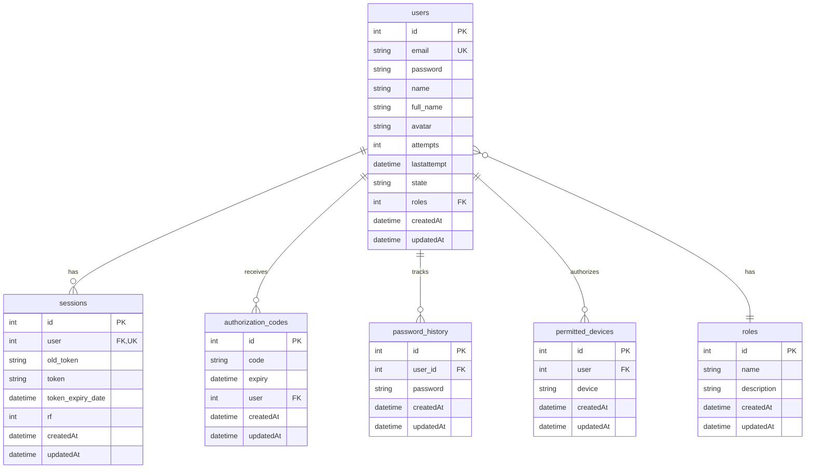
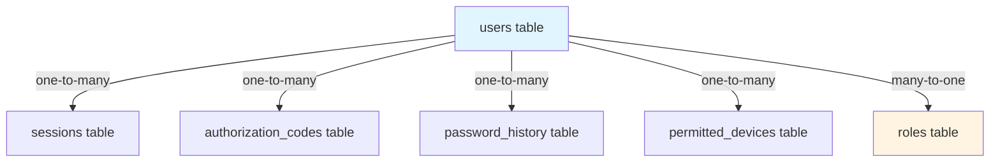

# DATABASE

## Overview

The WORM API uses PostgreSQL as its primary database with Waterline ORM for data modeling and queries. The database schema consists of 6 core models that handle users, authentication, authorization, and security tracking.

**Database**: PostgreSQL 12+  
**ORM**: Waterline 0.13.x  
**Connection**: [`config/database.js`](config/database.js:1)

---

## Database Architecture



---

## Waterline ORM Integration

### Configuration

Waterline is configured in [`config/database.js`](config/database.js:1) and initialized in [`utils/util-database.js`](utils/util-database.js:1).

```javascript
const Waterline = require('waterline');
const sailsPostgresql = require('sails-postgresql');

const waterline = new Waterline();

// Register models
const models = require('../models');
Object.values(models).forEach(model => {
  waterline.registerModel(Waterline.Collection.extend(model('postgresql')));
});

// Initialize
waterline.initialize(config, (err, ontology) => {
  if (err) throw err;
  
  // Access models via ontology.collections
  const Users = ontology.collections.users;
  const Roles = ontology.collections.roles;
  // ...
});
```

### Query Examples

```javascript
// Find one user
const user = await Users.findOne({ email: 'user@example.com' });

// Find with population
const user = await Users.findOne({ id: 1 }).populate('roles');

// Create
const newUser = await Users.create({
  email: 'new@example.com',
  password: hashedPassword,
  name: 'New User',
  state: 'active',
  roles: 2
});

// Update
await Users.update({ id: 1 }, { full_name: 'Updated Name' });

// Delete
await Users.destroy({ id: 1 });

// Complex queries
const activeUsers = await Users.find({
  state: 'active',
  attempts: { '<': 3 },
  createdAt: { '>=': new Date('2024-01-01') }
}).sort('createdAt DESC').limit(10);
```

---

## Model Definitions

### 1. users

**Location**: [`models/db/users.js`](models/db/users.js:1)

Stores user accounts, authentication data, and profile information.

```javascript
module.exports = function (conn) {
  return {
    identity: 'users',
    connection: conn,
    attributes: {
      name: {
        type: 'string',
        index: true
      },
      password: {
        type: 'string',
        required: true
      },
      email: {
        type: 'string',
        unique: true,
        index: true
      },
      attempts: {
        type: 'integer'
      },
      lastattempt: {
        type: 'datetime'
      },
      full_name: { 
        type: 'string' 
      },
      avatar: { 
        type: 'string' 
      },
      roles: {
        index: true,
        model: 'roles'
      },
      state: {
        type: 'string',
        enum: ['active', 'inactive'],
        defaultsTo: 'inactive',
        index: true
      }
    },
    permissions: {
      admin: ['read', 'write', 'delete'],
      user: ['read', 'write']
    }
  };
};
```

**Fields**:

| Field | Type | Constraints | Description |
|-------|------|-------------|-------------|
| `id` | integer | PK, Auto-increment | Unique user identifier |
| `name` | string | Indexed | User's display name |
| `email` | string | Unique, Indexed, Required | User's email (used for login) |
| `password` | string | Required | Hashed and salted password |
| `full_name` | string | - | User's complete name |
| `avatar` | string | - | Base64 encoded avatar image |
| `attempts` | integer | Default: 0 | Failed login attempts counter |
| `lastattempt` | datetime | Nullable | Timestamp of last failed login |
| `roles` | integer | FK to roles, Indexed | User's role ID |
| `state` | enum | 'active', 'inactive' | Account state |
| `createdAt` | datetime | Auto | Record creation timestamp |
| `updatedAt` | datetime | Auto | Record update timestamp |

**Relationships**:
- **belongs to** `roles` (many-to-one)
- **has many** `sessions`, `authorization_codes`, `password_history`, `permitted_devices`

**Indexes**:
- `name` (for search/filtering)
- `email` (for login lookups, unique)
- `roles` (for permission queries)
- `state` (for filtering active users)

**Permissions**:
- **admin**: Full access (read, write, delete)
- **user**: Can read and write own record

---

### 2. roles

**Location**: [`models/db/roles.js`](models/db/roles.js:1)

Defines user roles for RBAC system.

```javascript
module.exports = function(conn) {
  return {
    identity: 'roles',
    connection: conn,
    attributes: {
      name: {
        type: 'string'
      },
      description: {
        type: 'string'
      }
    },
    permissions: {
      admin: ['read','write'],
      user: []
    }
  };
};
```

**Fields**:

| Field | Type | Description |
|-------|------|-------------|
| `id` | integer | PK, Auto-increment |
| `name` | string | Role name (e.g., 'admin', 'user') |
| `description` | string | Human-readable description |
| `createdAt` | datetime | Auto |
| `updatedAt` | datetime | Auto |

**Relationships**:
- **has many** `users`

**Default Roles**:
```sql
INSERT INTO roles (id, name, description) VALUES
  (1, 'admin', 'Administrator with full access'),
  (2, 'user', 'Standard user with limited access');
```

**Permissions**:
- **admin**: Can read and write roles
- **user**: No access (view-only through joins)

---

### 3. sessions

**Location**: [`models/db/sessions.js`](models/db/sessions.js:1)

Stores active JWT sessions for users.

```javascript
module.exports = function(conn) {
  return {
    identity: 'sessions',
    connection: conn,
    attributes: {
      user: {
        index: true,
        model: 'users',
        unique: true
      },
      old_token: {
        type: 'string',
      },
      token: {
        type: 'string',
        index: true,
      },
      token_expiry_date: {
        type: 'datetime',
        index: true
      },
      rf: {
        type: 'integer',
        size: 256,
        index: true
      }
    },
    permissions: {
      admin: [],
      user: []
    }
  };
};
```

**Fields**:

| Field | Type | Constraints | Description |
|-------|------|-------------|-------------|
| `id` | integer | PK, Auto-increment | Session ID |
| `user` | integer | FK to users, Unique, Indexed | User ID (one session per user) |
| `token` | string | Indexed | Current JWT token |
| `old_token` | string | - | Previous JWT token (for rotation) |
| `token_expiry_date` | datetime | Indexed | Token expiration timestamp |
| `rf` | integer | Indexed | Refresh counter or flag |
| `createdAt` | datetime | Auto | Session creation |
| `updatedAt` | datetime | Auto | Last session update |

**Relationships**:
- **belongs to** `users` (one-to-one)

**Indexes**:
- `user` (unique, for fast user session lookup)
- `token` (for token validation)
- `token_expiry_date` (for cleanup queries)
- `rf` (refresh-related queries)

**Permissions**:
- **admin**: No API access (internal only)
- **user**: No API access (internal only)

**Note**: Sessions are managed internally by [`util-session.js`](utils/util-session.js:1) and not exposed via generic CRUD endpoints.

---

### 4. authorization_codes

**Location**: [`models/db/authorization_codes.js`](models/db/authorization_codes.js:1)

Temporary codes for password reset and device verification.

```javascript
module.exports = function(conn) {
  return {
    identity: 'authorization_codes',
    connection: conn,
    attributes: {
      code: {
        type: 'string',
        index: true
      },
      expiry: {
        type: 'datetime',
        index: true
      },
      user: {
        model: 'users'
      }
    },
    permissions: {
      admin: [],
      user:[]
    }
  };
};
```

**Fields**:

| Field | Type | Constraints | Description |
|-------|------|-------------|-------------|
| `id` | integer | PK, Auto-increment | Code ID |
| `code` | string | Indexed | Access code (e.g., 'A3F2-D4E-B1C9-A') |
| `expiry` | datetime | Indexed | Code expiration timestamp |
| `user` | integer | FK to users | User who receives the code |
| `createdAt` | datetime | Auto | Code generation time |
| `updatedAt` | datetime | Auto | Last update |

**Relationships**:
- **belongs to** `users`

**Code Types**:
- **Password Reset**: Ends with `-A` (e.g., `A3F2-D4E-B1C9-A`)
- **Device Verification**: Ends with `-B` (e.g., `B7E4-F2D-A8C6-B`)

**Indexes**:
- `code` (for validation lookups)
- `expiry` (for cleanup of expired codes)

**Permissions**:
- **admin**: No API access (managed internally)
- **user**: No API access (managed internally)

**Automatic Cleanup**:
```sql
-- Recommended cron job to delete expired codes
DELETE FROM authorization_codes WHERE expiry < NOW();
```

---

### 5. password_history

**Location**: [`models/db/password_history.js`](models/db/password_history.js:1)

Tracks password history to prevent reuse.

```javascript
module.exports = function (conn) {
  return {
    identity: 'password_history',
    connection: conn,
    attributes: {
      password: {
        type: 'string',
        required: true
      },
      user_id: {
        index: true,
        model: 'users'
      },
    },
    permissions: {
      admin: ['read', 'write', 'delete'],
      user: []
    }
  };
};
```

**Fields**:

| Field | Type | Constraints | Description |
|-------|------|-------------|-------------|
| `id` | integer | PK, Auto-increment | History record ID |
| `user_id` | integer | FK to users, Indexed | User whose password this tracks |
| `password` | string | Required | Salted and hashed password |
| `createdAt` | datetime | Auto | When password was set |
| `updatedAt` | datetime | Auto | Last update |

**Relationships**:
- **belongs to** `users`

**Indexes**:
- `user_id` (for user password history queries)

**Usage**:
- System checks last N passwords (default: 5) when user changes password
- Prevents password reuse within lookback window
- Passwords are hashed and salted before storage

**Permissions**:
- **admin**: Can view and manage password history
- **user**: No access

---

### 6. permitted_devices

**Location**: [`models/db/permitted_devices.js`](models/db/permitted_devices.js:1)

Whitelist of authorized devices per user.

```javascript
module.exports = function(conn) {
  return {
    identity: 'permitted_devices',
    connection: conn,
    attributes: {
      device: {
        type: 'string',
        index: true
      },
      user: {
        model: 'users'
      }
    },
    permissions: {
      admin: [],
      user: []
    }
  };
};
```

**Fields**:

| Field | Type | Constraints | Description |
|-------|------|-------------|-------------|
| `id` | integer | PK, Auto-increment | Record ID |
| `device` | string | Indexed | Device UUID |
| `user` | integer | FK to users | User who owns the device |
| `createdAt` | datetime | Auto | When device was authorized |
| `updatedAt` | datetime | Auto | Last update |

**Relationships**:
- **belongs to** `users`

**Indexes**:
- `device` (for device validation lookups)

**Device UUID Format**:
- Standard UUID v4 format: `550e8400-e29b-41d4-a716-446655440000`
- Generated client-side and sent with login requests

**Permissions**:
- **admin**: No API access (managed internally)
- **user**: No API access (managed internally)

---

## Relationships Overview



**Foreign Key Relationships**:
- `users.roles` → `roles.id`
- `sessions.user` → `users.id` (unique)
- `authorization_codes.user` → `users.id`
- `password_history.user_id` → `users.id`
- `permitted_devices.user` → `users.id`

---

## Adding New Models

### Step-by-Step Guide

#### 1. Create Model File

Create a new file in [`models/db/`](models/db/) directory:

```javascript
// models/db/projects.js
'use strict';

module.exports = function(conn) {
  return {
    identity: 'projects',
    connection: conn,
    attributes: {
      name: {
        type: 'string',
        required: true,
        index: true
      },
      description: {
        type: 'text'
      },
      status: {
        type: 'string',
        enum: ['active', 'completed', 'archived'],
        defaultsTo: 'active',
        index: true
      },
      owner: {
        model: 'users',
        index: true
      },
      start_date: {
        type: 'date'
      },
      end_date: {
        type: 'date'
      }
    },
    permissions: {
      admin: ['read', 'write', 'delete'],
      user: ['read', 'write']
    }
  };
};
```

#### 2. Register Model

The model is automatically registered via [`models/index.js`](models/index.js:1), which dynamically loads all files from [`models/db/`](models/db/).

#### 3. Update Permissions Configuration

Add model permissions to [`config/permissions.js`](config/permissions.js:1):

```javascript
permissions: {
  1: {
    name: 'admin',
    permissions: {
      // ... existing models
      projects: ['read', 'write', 'delete']
    }
  },
  2: {
    name: 'user',
    permissions: {
      // ... existing models
      projects: ['read', 'write']
    }
  }
}
```

#### 4. Add Query Constraints (Optional)

If users should only see their own projects, add constraints in [`utils/util-permission-middleware.js`](utils/util-permission-middleware.js:1):

```javascript
if (model === 'projects' && roleName === 'user') {
  req.query.owner = req.decoded.id;
}
```

#### 5. Test the Model

```bash
# Create a project
curl -X POST http://localhost:3000/generic/projects \
  -H "x-access-token: <token>" \
  -H "Content-Type: application/json" \
  -d '{
    "name": "New Project",
    "description": "Project description",
    "status": "active",
    "owner": 1
  }'

# List projects
curl -X GET http://localhost:3000/generic/projects \
  -H "x-access-token: <token>"
```

---

## Database Setup

### Initial Setup

#### 1. Install PostgreSQL

**Ubuntu/Debian**:
```bash
sudo apt update
sudo apt install postgresql postgresql-contrib
sudo systemctl start postgresql
sudo systemctl enable postgresql
```

**macOS**:
```bash
brew install postgresql@14
brew services start postgresql@14
```

**Windows**:
Download installer from [postgresql.org](https://www.postgresql.org/download/windows/)

#### 2. Create Database and User

```bash
# Connect as postgres user
sudo -u postgres psql

# Create database
CREATE DATABASE worm_api;

# Create user with password
CREATE USER worm_user WITH ENCRYPTED PASSWORD 'secure_password';

# Grant privileges
GRANT ALL PRIVILEGES ON DATABASE worm_api TO worm_user;

# Exit
\q
```

#### 3. Configure Environment

Update `.env` file:
```bash
DB_HOST=localhost
DB_PORT=5432
DB_NAME=worm_api
DB_USER=worm_user
DB_PASSWORD=secure_password
```

#### 4. Initialize Tables

The application will automatically create tables on first run using Waterline's migration system.

**Migration Modes** (in [`config/database.js`](config/database.js:1)):
- `safe`: Never auto-migrate (recommended for production)
- `alter`: Auto-migrate, preserve data (development)
- `drop`: Drop and recreate (testing only)

```javascript
defaults: {
  migrate: 'alter' // Change to 'safe' for production
}
```

#### 5. Seed Initial Data

Create admin role and user:

```sql
-- Connect to database
psql -U worm_user -d worm_api

-- Insert roles
INSERT INTO roles (id, name, description, "createdAt", "updatedAt") VALUES
  (1, 'admin', 'Administrator with full access', NOW(), NOW()),
  (2, 'user', 'Standard user with limited access', NOW(), NOW());

-- Insert admin user (password: AdminPassword123!@#)
-- Note: Use actual hashed password from application
INSERT INTO users (email, name, password, full_name, state, roles, attempts, "createdAt", "updatedAt") VALUES
  ('admin@example.com', 'Admin', '<hashed-password>', 'System Administrator', 'active', 1, 0, NOW(), NOW());
```

**Generate Admin Password**:
```javascript
const crypto = require('crypto');
const password = 'AdminPassword123!@#';
const hash = crypto.createHash('sha256').update(password).digest('hex');
console.log(hash);
```

---

## Database Maintenance

### Backup and Restore

#### Backup Database

```bash
# Full database backup
pg_dump -U worm_user -h localhost worm_api > backup.sql

# Compressed backup
pg_dump -U worm_user -h localhost worm_api | gzip > backup.sql.gz

# Backup with timestamp
pg_dump -U worm_user -h localhost worm_api > backup_$(date +%Y%m%d_%H%M%S).sql
```

#### Restore Database

```bash
# Restore from backup
psql -U worm_user -d worm_api < backup.sql

# Restore compressed backup
gunzip -c backup.sql.gz | psql -U worm_user -d worm_api

# Create new database and restore
createdb -U postgres worm_api_restored
psql -U worm_user -d worm_api_restored < backup.sql
```

### Cleanup Tasks

#### Remove Expired Codes

```sql
-- Delete expired authorization codes
DELETE FROM authorization_codes WHERE expiry < NOW();
```

**Recommended**: Set up a cron job:
```bash
# Add to crontab (runs daily at 2 AM)
0 2 * * * psql -U worm_user -d worm_api -c "DELETE FROM authorization_codes WHERE expiry < NOW();"
```

#### Clean Old Sessions

```sql
-- Remove expired sessions
DELETE FROM sessions WHERE token_expiry_date < NOW();
```

#### Archive Old Password History

```sql
-- Keep only last 10 passwords per user
DELETE FROM password_history
WHERE id NOT IN (
  SELECT id FROM password_history
  WHERE user_id = password_history.user_id
  ORDER BY "createdAt" DESC
  LIMIT 10
);
```

### Performance Optimization

#### Analyze Tables

```sql
-- Update table statistics
ANALYZE users;
ANALYZE sessions;
ANALYZE authorization_codes;
```

#### Rebuild Indexes

```sql
-- Rebuild all indexes
REINDEX DATABASE worm_api;

-- Rebuild specific table
REINDEX TABLE users;
```

#### Vacuum Database

```sql
-- Standard vacuum (online)
VACUUM ANALYZE;

-- Full vacuum (requires table lock)
VACUUM FULL;
```

---

## Best Practices

### Schema Design

1. **Use Appropriate Data Types**
   - `string` for short text (names, emails)
   - `text` for long content (descriptions)
   - `datetime` for timestamps
   - `enum` for fixed options

2. **Add Indexes Strategically**
   - Foreign keys
   - Fields used in WHERE clauses
   - Fields used in ORDER BY
   - Unique constraints for business keys

3. **Normalize Data**
   - Avoid duplicate data
   - Use relationships instead of embedding
   - Consider denormalization only for performance

4. **Use Constraints**
   - `required` for mandatory fields
   - `unique` for business keys
   - `enum` for limited options
   - Foreign keys for referential integrity

### Query Optimization

1. **Use Indexes**
```javascript
// Good - uses index on email
Users.findOne({ email: 'user@example.com' });

// Bad - full table scan
Users.find({ full_name: { contains: 'John' } });
```

2. **Limit Results**
```javascript
// Always use limit for lists
Users.find({ state: 'active' }).limit(50);
```

3. **Selective Population**
```javascript
// Only populate when needed
Users.findOne({ id: 1 }).populate('roles');

// Avoid unnecessary populations
Users.find().populate('roles'); // May be expensive
```

4. **Use Projections**
```javascript
// Select only needed fields
Users.find()
  .select(['id', 'email', 'name'])
  .limit(100);
```

### Security Practices

1. **Never Store Plain Text Passwords**
   - Always hash with SHA-256
   - Add user-specific salt
   - Use [`util-auth.salt()`](utils/util-auth.js:43)

2. **Sanitize Inputs**
   - Waterline prevents SQL injection
   - Still validate data types and formats
   - Use enum for limited options

3. **Encrypt Sensitive Data**
   - Use AES-256-GCM for sensitive fields
   - Use [`util-encryption.js`](utils/util-encryption.js:1)

4. **Implement Audit Logging**
   - Track who, what, when
   - Log permission denials
   - Monitor suspicious activity

### Migration Strategy

**Development**:
```javascript
migrate: 'alter' // Auto-migrate, safe
```

**Production**:
```javascript
migrate: 'safe' // Manual migrations only
```

**Manual Migration Example**:
```sql
-- Add new column
ALTER TABLE users ADD COLUMN phone VARCHAR(20);

-- Add index
CREATE INDEX idx_users_phone ON users(phone);

-- Update existing records
UPDATE users SET phone = '' WHERE phone IS NULL;
```

---

## Troubleshooting

### Connection Issues

**Problem**: Cannot connect to database

```bash
# Check PostgreSQL is running
sudo systemctl status postgresql

# Check connection
psql -U worm_user -d worm_api -h localhost

# Check pg_hba.conf for authentication
sudo nano /etc/postgresql/14/main/pg_hba.conf
```

**Solution**: Ensure `pg_hba.conf` allows connections:
```
# IPv4 local connections:
host    all             all             127.0.0.1/32            md5
```

### Migration Errors

**Problem**: Migration fails on startup

**Solution**: Reset database (development only):
```bash
# Drop all tables
psql -U worm_user -d worm_api -c "DROP SCHEMA public CASCADE; CREATE SCHEMA public;"

# Restart application
npm start
```

### Performance Issues

**Problem**: Slow queries

**Solution**: Add missing indexes:
```sql
-- Check slow queries
SELECT query, calls, total_time, mean_time
FROM pg_stat_statements
ORDER BY mean_time DESC
LIMIT 10;

-- Add indexes as needed
CREATE INDEX idx_name ON table_name(column_name);
```

### Disk Space

**Problem**: Database growing too large

**Solution**:
```bash
# Check database size
psql -U worm_user -d worm_api -c "SELECT pg_size_pretty(pg_database_size('worm_api'));"

# Check table sizes
psql -U worm_user -d worm_api -c "SELECT relname, pg_size_pretty(pg_total_relation_size(relid)) FROM pg_stat_user_tables ORDER BY pg_total_relation_size(relid) DESC;"

# Vacuum and cleanup
psql -U worm_user -d worm_api -c "VACUUM FULL ANALYZE;"
```

---

## See Also

- [`ARCHITECTURE.md`](ARCHITECTURE.md) - System architecture and data flow
- [`API_REFERENCE.md`](API_REFERENCE.md) - CRUD endpoints for models
- [`PERMISSIONS.md`](PERMISSIONS.md) - Model-level permissions
- [`CONFIGURATION.md`](CONFIGURATION.md) - Database configuration