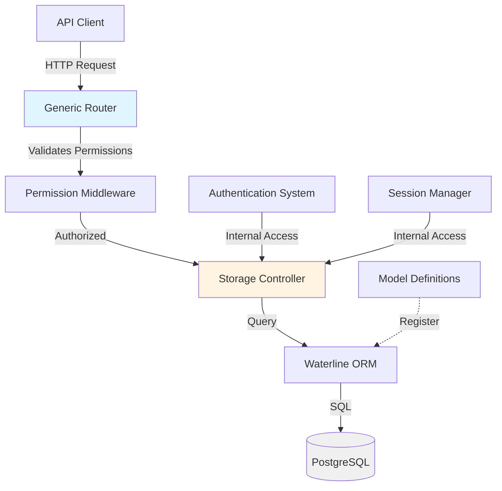

# DATABASE

## Overview

The WORM API framework provides a convention-based approach to data modeling and persistence. Instead of working directly with databases, you define JSON-based model schemas that the framework automatically exposes through RESTful API endpoints following JSON:API conventions.

**Framework Approach**: Define models → Framework handles storage → Interact via API endpoints

**Storage Abstraction**: [`controllers/storage-db.js`](controllers/storage-db.js:1)  
**Generic Router**: [`routers/generic.js`](routers/generic.js:1)  
**Model Directory**: [`models/db/`](models/db/)

---

## 1. Model Definition and Relationships

### Model Schema Structure

Models are defined as JSON schemas that export a function returning a model definition object. The framework automatically registers all models in [`models/db/`](models/db/).

**Basic Model Structure**:

```javascript
'use strict';

module.exports = function(conn) {
  return {
    identity: 'modelName',      // Singular model name
    connection: conn,            // Framework-provided connection
    attributes: {
      // Field definitions
    },
    permissions: {
      // Role-based access control
    }
  };
};
```

### Field Types

The framework supports these attribute types:

| Type | Description | Example |
|------|-------------|---------|
| `string` | Short text field | `name: { type: 'string' }` |
| `text` | Long text content | `description: { type: 'text' }` |
| `integer` | Whole numbers | `attempts: { type: 'integer' }` |
| `float` | Decimal numbers | `price: { type: 'float' }` |
| `boolean` | True/false values | `active: { type: 'boolean' }` |
| `datetime` | Date and time | `lastattempt: { type: 'datetime' }` |
| `date` | Date only | `birthdate: { type: 'date' }` |

### Field Constraints

```javascript
attributes: {
  email: {
    type: 'string',
    required: true,    // Field must be provided
    unique: true,      // Must be unique across records
    index: true        // Optimize queries on this field
  },
  state: {
    type: 'string',
    enum: ['active', 'inactive'],  // Only these values allowed
    defaultsTo: 'inactive'         // Default value if not provided
  }
}
```

### Relationships

#### One-to-Many (belongs to)

A model can reference another model using `model` attribute:

```javascript
// From users.js
attributes: {
  roles: {
    model: 'roles',   // References the 'roles' model
    index: true       // Index for faster lookups
  }
}
```

**API Representation**:
```json
{
  "type": "users",
  "id": 1,
  "attributes": { "name": "John" },
  "relationships": {
    "roles": {
      "data": { "type": "roles", "id": 2 }
    }
  }
}
```

#### Many-to-Many (has many)

Use `collection` and `via` for bidirectional many-to-many relationships:

```javascript
// In projects model
attributes: {
  members: {
    collection: 'users',   // References users collection
    via: 'projects'        // Through 'projects' field in users
  }
}

// In users model
attributes: {
  projects: {
    collection: 'projects',
    via: 'members'
  }
}
```

**API Representation**:
```json
{
  "type": "projects",
  "id": 5,
  "attributes": { "name": "Project Alpha" },
  "relationships": {
    "members": {
      "data": [
        { "type": "users", "id": 1 },
        { "type": "users", "id": 3 }
      ]
    }
  }
}
```

### Complete Model Examples

#### Users Model

**File**: [`models/db/users.js`](models/db/users.js:1)

```javascript
'use strict';
module.exports = function (conn) {
  return {
    identity: 'users',
    connection: conn,
    attributes: {
      name: {
        type: 'string',
        index: true
      },
      password: {
        type: 'string',
        required: true
      },
      email: {
        type: 'string',
        unique: true,
        index: true
      },
      attempts: {
        type: 'integer'
      },
      lastattempt: {
        type: 'datetime'
      },
      full_name: { 
        type: 'string' 
      },
      avatar: { 
        type: 'string' 
      },
      roles: {
        index: true,
        model: 'roles'      // One-to-many relationship
      },
      state: {
        type: 'string',
        enum: ['active', 'inactive'],
        defaultsTo: 'inactive',
        index: true
      }
    },
    permissions: {
      admin: ['read', 'write', 'delete'],
      user: ['read', 'write']
    }
  };
};
```

#### Roles Model

**File**: [`models/db/roles.js`](models/db/roles.js:1)

```javascript
'use strict';

module.exports = function(conn) {
  return {
    identity: 'roles',
    connection: conn,
    attributes: {
      name: {
        type: 'string'
      },
      description: {
        type: 'string'
      }
    },
    permissions: {
      admin: ['read','write'],
      user: []
    }
  };
};
```

### Permissions

Each model defines role-based permissions that control API access:

```javascript
permissions: {
  admin: ['read', 'write', 'delete'],  // Full access
  user: ['read', 'write'],             // No delete
  guest: []                            // No access via API
}
```

**Permission Types**:
- `read`: GET requests allowed
- `write`: POST/PATCH requests allowed
- `delete`: DELETE requests allowed

Models with empty permissions for a role are inaccessible via the generic API for that role, but can still be accessed internally by the framework.

---

## 2. API Interaction with Models

The framework automatically exposes models through RESTful endpoints following JSON:API specification conventions.

### Endpoint Structure

**Base Pattern**: `/generic/{pluralizedModelName}`

The framework uses [`pluralize`](https://www.npmjs.com/package/pluralize) to automatically convert model names to their plural forms:

| Model Identity | API Endpoint |
|----------------|--------------|
| `users` | `/generic/users` |
| `roles` | `/generic/roles` |
| `sessions` | `/generic/sessions` |
| `authorization_codes` | `/generic/authorization_codes` |

### CRUD Operations

#### Create (POST)

**Endpoint**: `POST /generic/{model}`

**Single Record**:
```bash
curl -X POST http://localhost:3000/generic/users \
  -H "x-access-token: YOUR_TOKEN" \
  -H "Content-Type: application/json" \
  -d '{
    "data": {
      "type": "users",
      "attributes": {
        "name": "Jane Doe",
        "email": "jane@example.com",
        "password": "hashed_password",
        "state": "active"
      },
      "relationships": {
        "roles": {
          "data": { "type": "roles", "id": 2 }
        }
      }
    }
  }'
```

**Multiple Records**:
```bash
curl -X POST http://localhost:3000/generic/users \
  -H "x-access-token: YOUR_TOKEN" \
  -H "Content-Type: application/json" \
  -d '{
    "data": [
      {
        "type": "users",
        "attributes": { "name": "User 1", "email": "user1@example.com" }
      },
      {
        "type": "users",
        "attributes": { "name": "User 2", "email": "user2@example.com" }
      }
    ]
  }'
```

**Response**:
```json
{
  "data": {
    "type": "users",
    "id": 42,
    "attributes": {
      "name": "Jane Doe",
      "email": "jane@example.com",
      "state": "active"
    },
    "relationships": {
      "roles": {
        "data": { "type": "roles", "id": 2 }
      }
    }
  }
}
```

#### Read (GET)

**List All**:
```bash
GET /generic/users
```

**Get by ID**:
```bash
GET /generic/users/42
```

**Response Format**:
```json
{
  "meta": {
    "totalrecords": 150,
    "query": { "state": "active" },
    "limit": 100,
    "skip": 0,
    "sort": { "id": "ASC" }
  },
  "data": [
    {
      "type": "users",
      "id": 1,
      "attributes": {
        "name": "John Doe",
        "email": "john@example.com",
        "state": "active"
      },
      "relationships": {
        "roles": {
          "data": { "type": "roles", "id": 2 }
        }
      }
    }
  ]
}
```

#### Update (PATCH)

**Endpoint**: `PATCH /generic/{model}/{id}`

```bash
curl -X PATCH http://localhost:3000/generic/users/42 \
  -H "x-access-token: YOUR_TOKEN" \
  -H "Content-Type: application/json" \
  -d '{
    "data": {
      "type": "users",
      "id": 42,
      "attributes": {
        "full_name": "Jane Elizabeth Doe"
      }
    }
  }'
```

**Response**:
```json
{
  "data": {
    "id": 42,
    "type": "users",
    "attributes": {
      "id": 42,
      "full_name": "Jane Elizabeth Doe"
    },
    "relationships": {}
  }
}
```

#### Delete (DELETE)

**Endpoint**: `DELETE /generic/{model}/{id}`

```bash
curl -X DELETE http://localhost:3000/generic/users/42 \
  -H "x-access-token: YOUR_TOKEN"
```

**Response**:
```json
{
  "meta": {
    "success": true
  }
}
```

### Query Parameters

#### Filtering

Add query parameters to filter results:

```bash
# Filter by single field
GET /generic/users?state=active

# Filter by multiple fields
GET /generic/users?state=active&name=John

# Complex queries (URL encoded JSON)
GET /generic/users?attempts={"<":3}
```

**Comparison Operators**:
- `{"<": value}` - Less than
- `{"<=": value}` - Less than or equal
- `{">": value}` - Greater than
- `{">=": value}` - Greater than or equal
- `{"!": value}` - Not equal

#### Pagination

```bash
# Skip first 20 records, return next 10
GET /generic/users?skip=20&limit=10
```

**Default Values**:
- `limit`: 100 records
- `skip`: 0 (start from beginning)

The `meta` object in the response includes pagination info:

```json
{
  "meta": {
    "totalrecords": 150,
    "limit": 10,
    "skip": 20
  },
  "data": [...]
}
```

#### Sorting

```bash
# Sort by name ascending
GET /generic/users?sort={"name":"ASC"}

# Sort by created date descending
GET /generic/users?sort={"createdAt":"DESC"}

# Multiple sort fields
GET /generic/users?sort={"state":"ASC","name":"ASC"}
```

#### Relationship Filtering

Filter by related model IDs:

```bash
# Find all users with role ID 2
GET /generic/users?roles=2

# Find users with specific role IDs (array)
GET /generic/users?roles=[1,2]
```

### Relationship Population

The framework automatically populates (includes) related records in responses based on the model's relationship definitions.

**Automatic Population**:
- **One-to-Many** (`model` attribute): Always populated
- **Many-to-Many** (`collection` attribute): Always populated

**Example Response with Populated Relationships**:
```json
{
  "data": {
    "type": "users",
    "id": 1,
    "attributes": {
      "name": "John Doe",
      "email": "john@example.com"
    },
    "relationships": {
      "roles": {
        "data": { "type": "roles", "id": 2 }
      }
    }
  }
}
```

The framework uses the [`routers/generic.js`](routers/generic.js:1) router to automatically detect and populate all relationship fields defined in the model schema.

---

## 3. Storage Controller Abstraction

The framework uses an internal storage abstraction layer ([`controllers/storage-db.js`](controllers/storage-db.js:1)) that provides a consistent interface for data operations, regardless of the underlying storage technology.

### Storage Controller Purpose

The storage controller:
1. **Abstracts database operations** - Provides a unified API for CRUD operations
2. **Handles connection management** - Manages database connection lifecycle
3. **Supports internal queries** - Enables custom queries beyond generic CRUD
4. **Enforces data integrity** - Validates and processes data before storage

### Internal Usage Pattern

The framework's authentication and session management systems use the storage controller directly:

**Example from [`utils/util-session.js`](utils/util-session.js:1)**:
```javascript
const storageDB = require('../controllers/storage-db');

// Read session data
const sessionData = await storageDB({
  type: 'read',
  table: 'sessions',
  query: { user: userId },
  attributes: ['roles']  // Populate relationships
});

// Update session
await storageDB({
  type: 'update',
  table: 'sessions',
  query: { id: sessionId },
   { token: newToken, token_expiry_date: expiryDate }
});
```

### Storage Operations

The storage controller supports these operation types:

#### Read Operation
```javascript
await storageDB({
  type: 'read',
  table: 'users',
  query: { email: 'user@example.com' },
  attributes: ['roles'],  // Populate relationships
  limit: 10,
  select: ['id', 'name', 'email']  // Select specific fields
});
```

#### Write Operation
```javascript
await storageDB({
  type: 'write',
  table: 'users',
   {
    name: 'New User',
    email: 'new@example.com',
    state: 'active'
  }
});
```

#### Update Operation
```javascript
await storageDB({
  type: 'update',
  table: 'users',
  query: { id: 42 },
   { full_name: 'Updated Name' }
});
```

#### Delete Operation
```javascript
await storageDB({
  type: 'destroy',
  table: 'users',
  query: { id: 42 }
});
```

#### Count Operation
```javascript
await storageDB({
  type: 'count',
  table: 'users',
  count: { state: 'active' }
});
```

#### Query Operation (Raw SQL)
```javascript
await storageDB({
  type: 'query',
  table: 'users',
  query: 'SELECT * FROM users WHERE state = $1',
  params: ['active']
});
```

### When to Use Storage Controller

The storage controller is used internally by the framework for:

1. **Authentication Operations** - Login, logout, token validation
2. **Session Management** - Token creation, renewal, expiration
3. **Authorization** - Permission checks, role validation
4. **Custom Business Logic** - Operations requiring complex queries
5. **System Maintenance** - Cleanup tasks, data migrations

**API users should NOT use the storage controller directly.** Instead, use the generic API endpoints which provide:
- Automatic permission enforcement
- JSON:API compliant formatting
- Relationship handling
- Pagination and filtering
- Consistent error handling

---

## Adding New Models

### Step-by-Step Guide

#### 1. Create Model File

Create a new file in [`models/db/`](models/db/):

```javascript
// models/db/projects.js
'use strict';

module.exports = function(conn) {
  return {
    identity: 'projects',
    connection: conn,
    attributes: {
      name: {
        type: 'string',
        required: true,
        index: true
      },
      description: {
        type: 'text'
      },
      status: {
        type: 'string',
        enum: ['active', 'completed', 'archived'],
        defaultsTo: 'active',
        index: true
      },
      owner: {
        model: 'users',
        index: true
      },
      start_date: {
        type: 'date'
      },
      end_date: {
        type: 'date'
      }
    },
    permissions: {
      admin: ['read', 'write', 'delete'],
      user: ['read', 'write']
    }
  };
};
```

#### 2. Automatic Registration

The model is automatically registered via [`models/index.js`](models/index.js:1), which dynamically loads all files from [`models/db/`](models/db/). No manual registration required.

#### 3. Configure Permissions

Update [`config/permissions.js`](config/permissions.js:1) to include the new model:

```javascript
permissions: {
  1: {
    name: 'admin',
    permissions: {
      // ... existing models
      projects: ['read', 'write', 'delete']
    }
  },
  2: {
    name: 'user',
    permissions: {
      // ... existing models
      projects: ['read', 'write']
    }
  }
}
```

#### 4. Add Query Constraints (Optional)

If users should only see their own records, add constraints in [`utils/util-permission-middleware.js`](utils/util-permission-middleware.js:1):

```javascript
if (model === 'projects' && roleName === 'user') {
  req.query.owner = req.decoded.id;  // Limit to user's own projects
}
```

#### 5. Test via API

```bash
# Create a project
curl -X POST http://localhost:3000/generic/projects \
  -H "x-access-token: YOUR_TOKEN" \
  -H "Content-Type: application/json" \
  -d '{
    "data": {
      "type": "projects",
      "attributes": {
        "name": "New Project",
        "description": "Project description",
        "status": "active"
      },
      "relationships": {
        "owner": {
          "data": { "type": "users", "id": 1 }
        }
      }
    }
  }'

# List projects
curl -X GET http://localhost:3000/generic/projects \
  -H "x-access-token: YOUR_TOKEN"

# Get specific project
curl -X GET http://localhost:3000/generic/projects/1 \
  -H "x-access-token: YOUR_TOKEN"
```

---

## Framework Database Architecture



**Flow Description**:

1. **API Client** sends HTTP request to generic endpoints
2. **Generic Router** ([`routers/generic.js`](routers/generic.js:1)) processes the request
3. **Permission Middleware** validates user permissions against model definitions
4. **Storage Controller** ([`controllers/storage-db.js`](controllers/storage-db.js:1)) abstracts data operations
5. **ORM Layer** translates to database-specific queries
6. **Database** (PostgreSQL) stores and retrieves data

Internal systems (authentication, sessions) bypass the API layer and use the storage controller directly.

---

## Best Practices

### Model Design

1. **Use Descriptive Names**
   - Models: singular (`user`, not `users`)
   - API endpoints: automatically pluralized by framework

2. **Index Strategically**
   - Add indexes to foreign keys
   - Index fields used in filters
   - Index fields used in sorting

3. **Define Relationships Explicitly**
   - Use `model` for one-to-many
   - Use `collection` + `via` for many-to-many
   - Always index relationship fields

4. **Set Appropriate Permissions**
   - Start restrictive, expand as needed
   - Use empty arrays to block API access
   - Consider user-specific filtering

### API Usage

1. **Use Pagination**
   - Always set reasonable `limit` values
   - Use `skip` for offset-based pagination
   - Check `totalrecords` in meta for total count

2. **Filter Efficiently**
   - Filter on indexed fields when possible
   - Use relationship filtering for joins
   - Combine filters to reduce result sets

3. **Handle Relationships**
   - Relationships auto-populate in responses
   - Use relationship filtering for queries
   - Include relationship data in POST/PATCH

4. **Follow JSON:API Format**
   - Always wrap data in `data` object
   - Include `type` field
   - Use `attributes` and `relationships` sections

### Security

1. **Never Store Plain Passwords**
   - Hash passwords before storage
   - Use framework encryption utilities
   - See [`AUTHENTICATION.md`](AUTHENTICATION.md) for details

2. **Respect Permissions**
   - Define model-level permissions
   - Implement query constraints for user isolation
   - Empty permissions block API access

3. **Validate Input**
   - Use `required` constraint for mandatory fields
   - Use `enum` for limited options
   - Use `unique` for business keys

---

## Common Patterns

### User-Specific Data Isolation

```javascript
// In util-permission-middleware.js
if (model === 'documents' && roleName === 'user') {
  req.query.owner = req.decoded.id;
}
```

### Soft Delete Pattern

```javascript
// Add to model
attributes: {
  deleted: {
    type: 'boolean',
    defaultsTo: false,
    index: true
  },
  deleted_at: {
    type: 'datetime'
  }
}

// Filter in middleware
if (model === 'projects') {
  req.query.deleted = false;  // Hide deleted records
}
```

### Audit Trail Pattern

```javascript
attributes: {
  created_by: {
    model: 'users',
    index: true
  },
  updated_by: {
    model: 'users'
  },
  createdAt: {
    type: 'datetime'
  },
  updatedAt: {
    type: 'datetime'
  }
}
```

---

## See Also

- [`API_REFERENCE.md`](API_REFERENCE.md) - Complete API endpoint documentation
- [`AUTHENTICATION.md`](AUTHENTICATION.md) - Authentication and session management
- [`PERMISSIONS.md`](PERMISSIONS.md) - Permission system details
- [`ARCHITECTURE.md`](ARCHITECTURE.md) - System architecture overview
- [`CONFIGURATION.md`](CONFIGURATION.md) - Configuration options