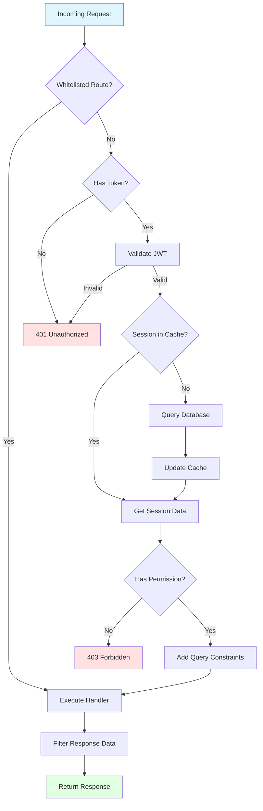

# PERMISSIONS

## Overview

The WORM API implements a comprehensive role-based access control (RBAC) system that restricts data access at both the query and response levels. The permission system ensures users can only access and modify data they're authorized to see based on their assigned role.

**Key Features**:
- Role-based permissions (read, write, delete, read_sensitive)
- Automatic query filtering based on user role
- Response-level data filtering
- Model-level permission configuration
- Whitelist for public routes

---

## Permission System Architecture



---

## Permission Configuration

Permissions are configured in [`config/permissions.js`](config/permissions.js:1) using a permission matrix that maps roles to their allowed operations.

### Permission Structure

```javascript
module.exports = {
  // Whitelisted routes that don't require authentication
  whitelist: [
    '/letmein/signin',
    '/letmein/gen-code',
    '/letmein/validate-code',
    '/ping'
  ],
  
  // Role-to-permission mapping
  permissions: {
    // Role ID as key
    1: { // Admin role
      name: 'admin',
      permissions: {
        users: ['read', 'write', 'delete', 'read_sensitive'],
        roles: ['read', 'write', 'delete'],
        sessions: ['read', 'delete'],
        authorization_codes: ['read', 'delete'],
        password_history: ['read', 'delete'],
        permitted_devices: ['read', 'write', 'delete']
      }
    },
    2: { // Standard user role
      name: 'user',
      permissions: {
        users: ['read', 'write'], // Can only read/write their own data
        roles: ['read'],
        sessions: [],
        authorization_codes: [],
        password_history: [],
        permitted_devices: ['read', 'write']
      }
    }
  }
};
```

### Available Permission Types

| Permission | Description | Allows |
|------------|-------------|--------|
| `read` | Read access | GET requests to retrieve resources |
| `write` | Write access | POST (create) and PATCH (update) requests |
| `delete` | Delete access | DELETE requests to remove resources |
| `read_sensitive` | Sensitive data access | View password-related and security fields |

**Important**: Permissions are cumulative within a role but not between roles.

---

## Model-Level Permissions

Each database model can define its own permission requirements in addition to the global configuration.

### Example from [`models/db/users.js`](models/db/users.js:42)

```javascript
module.exports = function (conn) {
  return {
    identity: 'users',
    connection: conn,
    attributes: {
      // ... fields
    },
    permissions: {
      admin: ['read', 'write', 'delete'],
      user: ['read', 'write']
    }
  };
};
```

### Example from [`models/db/sessions.js`](models/db/sessions.js:31)

```javascript
permissions: {
  admin: [],  // Even admins can't directly access sessions via API
  user: []    // Sessions are internal only
}
```

**Note**: If a model defines empty permissions for a role, that role cannot access the model through the API, even if they have general permissions in [`config/permissions.js`](config/permissions.js:1).

---

## Permission Middleware Flow

The permission middleware ([`utils/util-permission-middleware.js`](utils/util-permission-middleware.js:1)) processes every request through multiple validation stages.

### Stage 1: Route Whitelisting

```javascript
// Check if route is whitelisted (public)
const whitelist = ['/letmein/signin', '/letmein/gen-code', '/ping'];
if (whitelist.includes(req.path)) {
  return next(); // Skip authentication
}
```

### Stage 2: Token Validation

```javascript
// Extract token from header
const token = req.headers['x-access-token'];
if (!token) {
  return res.status(401).json({ error: 'No token provided' });
}

// Validate JWT token
const decoded = jwt.verify(token, JWT_SECRET);
req.decoded = decoded;
```

### Stage 3: Session Verification

The middleware checks for valid sessions using a three-tier strategy:

1. **LocalCache**: In-memory cache for fastest access
2. **Redis**: Distributed cache for multi-instance deployments
3. **Database**: PostgreSQL for persistence

```javascript
// Check LocalCache first
let session = LocalCache.get(`session_${decoded.id}`);

if (!session) {
  // Check Redis
  session = await Redis.get(`session_${decoded.id}`);
  
  if (!session) {
    // Query database
    session = await db.sessions.findOne({ 
      token: token,
      user: decoded.id 
    });
    
    // Update caches
    if (session) {
      await Redis.set(`session_${decoded.id}`, session, TTL);
      LocalCache.set(`session_${decoded.id}`, session);
    }
  }
}

if (!session || session.token_expiry_date < new Date()) {
  return res.status(401).json({ error: 'Invalid or expired session' });
}
```

### Stage 4: Permission Checking

```javascript
const userRole = req.decoded.roles; // Role ID from JWT
const model = req.params.model;      // e.g., 'users'
const method = req.method;           // GET, POST, PATCH, DELETE

// Get role permissions
const rolePermissions = permissions[userRole]?.permissions[model] || [];

// Map HTTP method to required permission
const requiredPermission = {
  'GET': 'read',
  'POST': 'write',
  'PATCH': 'write',
  'DELETE': 'delete'
}[method];

// Check if user has required permission
if (!rolePermissions.includes(requiredPermission)) {
  return res.status(403).json({ error: 'Insufficient permissions' });
}
```

### Stage 5: Query Adaptation

Based on the user's role, the middleware automatically adds constraints to database queries to ensure users only access their authorized data.

**For Standard Users** (role: user):
```javascript
// Original query: GET /generic/users
// Adapted query adds constraint
req.query.id = req.decoded.id; // User can only see their own record

// Original query: GET /generic/users?state=active
// Adapted query
req.query.id = req.decoded.id;
req.query.state = 'active';
```

**For Admins** (role: admin):
```javascript
// No constraints added - admins see all data
```

### Stage 6: Response Filtering

After the handler executes, the middleware filters sensitive data from responses based on permissions.

```javascript
// If user doesn't have 'read_sensitive' permission
if (!rolePermissions.includes('read_sensitive')) {
  // Remove sensitive fields from response
  const sensitiveFields = ['password', 'old_token', 'rf'];
  sensitiveFields.forEach(field => {
    if (Array.isArray(responseData)) {
      responseData.forEach(item => delete item[field]);
    } else {
      delete responseData[field];
    }
  });
}
```

---

## Query Constraints by Role

### Admin Role

Admins have unrestricted access to all data they have permissions for:

```javascript
// GET /generic/users
// Returns ALL users in the system
{
  "data": [
    { "id": 1, "email": "user1@example.com", ... },
    { "id": 2, "email": "user2@example.com", ... },
    { "id": 3, "email": "user3@example.com", ... }
  ]
}
```

### User Role

Standard users are restricted to their own 

```javascript
// GET /generic/users (user ID: 2)
// Automatically adds constraint: WHERE id = 2
{
  "data": [
    { "id": 2, "email": "user2@example.com", ... }
  ]
}

// GET /generic/users/3 (user ID: 2)
// Returns 403 Forbidden - can't access other users
```

### Custom Role Constraints

You can implement custom query constraints in [`util-permission-middleware.js`](utils/util-permission-middleware.js:1):

```javascript
// Example: Project-based access control
if (roleName === 'project_manager') {
  req.query.project_id = req.decoded.project_id;
}

// Example: Company-based access control
if (roleName === 'company_admin') {
  req.query.company_id = req.decoded.company_id;
}
```

---

## Whitelisted (Public) Routes

Routes in the whitelist can be accessed without authentication. These are configured in [`config/permissions.js`](config/permissions.js:1).

### Default Whitelist

```javascript
whitelist: [
  '/letmein/signin',           // User sign-in
  '/letmein/gen-code',         // Generate access code
  '/letmein/validate-code',    // Validate access code
  '/ping'                      // Health check
]
```

### Adding Routes to Whitelist

Edit [`config/permissions.js`](config/permissions.js:1):

```javascript
whitelist: [
  '/letmein/signin',
  '/letmein/gen-code',
  '/letmein/validate-code',
  '/ping',
  '/public/documentation',     // New public route
  '/public/status'             // New public route
]
```

**Security Note**: Be cautious when adding routes to the whitelist. Ensure no sensitive data is exposed.

---

## Configuring Permissions

### Adding a New Role

1. **Define Role in Database**:
```sql
INSERT INTO roles (name, description) VALUES ('project_manager', 'Project Manager Role');
```

2. **Add Permission Configuration** in [`config/permissions.js`](config/permissions.js:1):
```javascript
permissions: {
  1: { name: 'admin', permissions: { ... } },
  2: { name: 'user', permissions: { ... } },
  3: { // New role ID
    name: 'project_manager',
    permissions: {
      users: ['read', 'write'],
      roles: ['read'],
      sessions: [],
      projects: ['read', 'write', 'delete'], // New model
      tasks: ['read', 'write', 'delete']     // New model
    }
  }
}
```

3. **Implement Query Constraints** in [`util-permission-middleware.js`](utils/util-permission-middleware.js:1):
```javascript
if (roleName === 'project_manager') {
  // Restrict to user's assigned projects
  if (model === 'projects' || model === 'tasks') {
    req.query.manager_id = req.decoded.id;
  }
}
```

### Modifying Existing Permissions

Edit [`config/permissions.js`](config/permissions.js:1):

```javascript
2: {
  name: 'user',
  permissions: {
    users: ['read', 'write'],
    roles: ['read'],
    sessions: [],
    authorization_codes: ['read'],  // Added read permission
    password_history: [],
    permitted_devices: ['read', 'write', 'delete']  // Added delete
  }
}
```

### Adding Model-Level Permissions

When creating a new model, define its permissions:

```javascript
// models/db/projects.js
module.exports = function (conn) {
  return {
    identity: 'projects',
    connection: conn,
    attributes: {
      name: { type: 'string' },
      manager: { model: 'users' }
    },
    permissions: {
      admin: ['read', 'write', 'delete'],
      project_manager: ['read', 'write', 'delete'],
      user: ['read']
    }
  };
};
```

---

## Permission Checking Examples

### Example 1: Admin Access

**User**: Admin (role ID: 1)  
**Request**: `GET /generic/users?state=active`

```javascript
// Permission check
rolePermissions = ['read', 'write', 'delete', 'read_sensitive']
requiredPermission = 'read'
hasPermission = true ✓

// Query adaptation
// No constraints added (admin sees all)

// Response
{
  "data": [
    { "id": 1, "email": "admin@example.com", "password": "..." },
    { "id": 2, "email": "user@example.com", "password": "..." }
  ]
}
```

### Example 2: Standard User Access

**User**: Standard User (role ID: 2, user ID: 5)  
**Request**: `GET /generic/users`

```javascript
// Permission check
rolePermissions = ['read', 'write']
requiredPermission = 'read'
hasPermission = true ✓

// Query adaptation
req.query.id = 5 // Constrained to own record

// Response filtering (no read_sensitive)
{
  "data": [
    { 
      "id": 5, 
      "email": "user@example.com"
      // password field removed
    }
  ]
}
```

### Example 3: Forbidden Access

**User**: Standard User (role ID: 2)  
**Request**: `GET /generic/sessions`

```javascript
// Permission check
rolePermissions = [] // Empty for sessions model
requiredPermission = 'read'
hasPermission = false ✗

// Response
{
  "status": 403,
  "error": "Insufficient permissions"
}
```

### Example 4: Delete Operation

**User**: Standard User (role ID: 2)  
**Request**: `DELETE /generic/users/5`

```javascript
// Permission check
rolePermissions = ['read', 'write'] // No 'delete'
requiredPermission = 'delete'
hasPermission = false ✗

// Response
{
  "status": 403,
  "error": "Insufficient permissions"
}
```

---

## Best Practices

### Security Recommendations

1. **Principle of Least Privilege**: Grant only the minimum permissions required
2. **Default Deny**: Start with no permissions and explicitly grant access
3. **Sensitive Data**: Use `read_sensitive` sparingly and only for trusted roles
4. **Model Permissions**: Always define permissions at the model level
5. **Query Constraints**: Implement role-specific query filters for multi-tenant data

### Permission Design Guidelines

1. **Role Hierarchy**: Design roles with clear hierarchies (e.g., admin > manager > user)
2. **Granular Permissions**: Use specific permissions rather than broad access
3. **Audit Trail**: Log permission changes and access attempts
4. **Regular Review**: Periodically audit