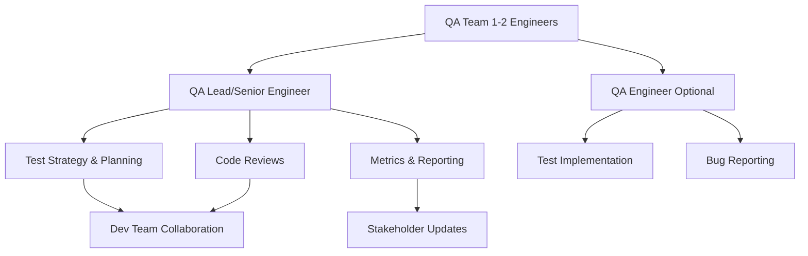
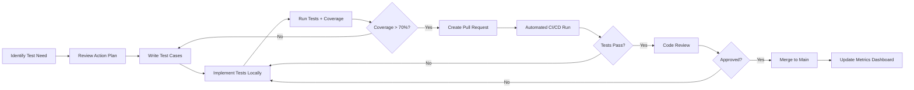

# QA Coordination & Handoff Documentation

**Project:** worm_api
**Document Version:** 1.0
**Created:** February 7, 2026
**Team Size:** 1-2 QA Engineers (Internal Team Expansion)
**Sprint Cadence:** 2-week sprints
**Quality Gates:** Enforced from start

---

## 🚀 Quick Start Guide

**New to the QA team? Start here:**

1. **Read this section first** - Get oriented in 5 minutes
2. **Review the [Handoff Checklist](#9-handoff-checklist)** - Your first week roadmap
3. **Explore the [QA Action Plan](../plans/qa-action-plan-complete.md)** - Your sprint-by-sprint guide
4. **Set up your environment** - Follow [Environment Setup](#environment-setup-steps)
5. **Run your first tests** - Use commands in [Tools & Infrastructure](#6-tools--infrastructure)

**Critical First Steps:**
- ✅ Clone repository and install dependencies (`npm ci`)
- ✅ **Set `RUNNING_TESTS=true` environment variable** (⚠️ REQUIRED for all test execution)
- ✅ Run `npm test` to verify 433 tests pass
- ✅ Run `npm run test:coverage` to see current 36.94% baseline
- ✅ Review Phase 1 priorities in the QA action plan

**Your Mission:** Increase test coverage from 36.94% to 70%+ across 28 source modules over 5 implementation phases.

---

## Table of Contents

1. [Executive Summary](#1-executive-summary)
2. [QA Team Structure & Responsibilities](#2-qa-team-structure--responsibilities)
3. [Testing Workflow & Processes](#3-testing-workflow--processes)
4. [Quality Gates & Standards](#4-quality-gates--standards)
5. [Sprint Planning & Execution](#5-sprint-planning--execution)
6. [Tools & Infrastructure](#6-tools--infrastructure)
7. [Knowledge Base & Resources](#7-knowledge-base--resources)
8. [Metrics & Reporting](#8-metrics--reporting)
9. [Handoff Checklist](#9-handoff-checklist)
10. [Communication Plan](#10-communication-plan)
11. [Risk Management](#11-risk-management)
12. [Continuous Improvement](#12-continuous-improvement)

---

## 1. Executive Summary

### Project Overview

The worm_api is a secure REST API built with Node.js/Express that provides authentication, authorization, and CRUD operations with comprehensive security features including JWT tokens, role-based permissions, device validation, and encrypted session management.

### Current Status (Baseline as of Feb 7, 2026)

| Metric | Current | Target | Gap | Status |
|--------|---------|--------|-----|--------|
| **Line Coverage** | 36.94% | 70% | -33.06% | 🔴 Critical |
| **Branch Coverage** | 83.94% | 70% | +13.94% | ✅ Exceeds |
| **Function Coverage** | 29.01% | 70% | -40.99% | 🔴 Critical |
| **Test Count** | 433 passing | ~720+ tests | +287 tests needed | 🟡 In Progress |

**Test Distribution:**
- **Unit Tests:** 386 tests across 8 files
- **Integration Tests:** 47 tests across 3 files
- **Test Framework:** Node.js native test runner (`node:test`)
- **No External Dependencies:** Uses built-in Node.js testing capabilities

### Key Achievements

✅ **Coverage baseline established** - Documented at [`plans/coverage-baseline.md`](../plans/coverage-baseline.md)  
✅ **Gap analysis completed** - 28 modules analyzed, 12 Priority 1 critical gaps identified  
✅ **Action plan created** - 5-phase implementation plan at [`plans/qa-action-plan-complete.md`](../plans/qa-action-plan-complete.md)  
✅ **CI/CD pipeline configured** - GitHub Actions workflow for automated coverage reporting  
✅ **142 session tests implemented** - Comprehensive session management coverage  
✅ **Test infrastructure established** - Mock helpers, test patterns, and documentation  

### Next Steps & Priorities

**Immediate Priorities (Phase 1 - First Sprint):**

1. **Critical Security Testing** - Session management and authentication (Priority 1)
   - Expand [`util-session.js`](../utils/util-session.js) coverage from 11.80% to 95%+
   - Complete [`util-auth.js`](../utils/util-auth.js) coverage from 38.75% to 95%+
   - Test all [`letmein.js`](../routers/letmein.js) authentication endpoints

2. **Set Up Quality Gates** - Enforce 70% coverage thresholds on all PRs
3. **Establish Metrics Dashboard** - Track daily/weekly progress
4. **Complete Team Onboarding** - Environment setup and training

**Success Criteria:**
- ✅ Phase 1 delivers 95%+ coverage on security-critical modules
- ✅ All new PRs meet 70% coverage threshold
- ✅ Zero security vulnerabilities in authentication code
- ✅ QA team fully productive within first week

---

## 2. QA Team Structure & Responsibilities

### Team Composition (1-2 QA Engineers)



### Role: QA Lead / Senior QA Engineer

**Primary Responsibilities:**

1. **Test Strategy & Planning**
   - Own the 5-phase QA action plan execution
   - Prioritize test development based on risk assessment
   - Collaborate with Dev Lead on sprint planning
   - Update coverage metrics and dashboards weekly

2. **Test Development**
   - Write unit and integration tests for Priority 1 modules
   - Review and approve test code from QA Engineer
   - Establish test patterns and best practices
   - Maintain test helper utilities

3. **Quality Assurance**
   - Enforce quality gates on all pull requests
   - Review test coverage reports before merges
   - Identify and document security vulnerabilities
   - Sign off on Phase completion criteria

4. **Reporting & Communication**
   - Daily standup updates on testing progress
   - Weekly coverage reports to stakeholders
   - Sprint retrospective facilitation
   - Escalate blockers to development team

5. **Mentorship** (if 2-person team)
   - Onboard and train QA Engineer
   - Review and provide feedback on test code
   - Share testing best practices and patterns

**Required Skills:**
- Strong Node.js and JavaScript testing experience
- Understanding of security testing (OAuth, JWT, encryption)
- Experience with native Node.js test runner or Jest
- CI/CD pipeline knowledge (GitHub Actions)
- API testing expertise (REST, JSON:API)

### Role: QA Engineer (Optional - 2-person team)

**Primary Responsibilities:**

1. **Test Implementation**
   - Write unit tests for assigned modules
   - Implement integration test scenarios
   - Extend existing test files per action plan
   - Use test helpers and mock objects

2. **Test Execution & Bug Reporting**
   - Run tests locally before submitting PRs
   - Monitor CI/CD test execution
   - Document and report test failures
   - Verify bug fixes with tests

3. **Documentation**
   - Update test documentation as needed
   - Document test patterns discovered
   - Maintain test README files

4. **Collaboration**
   - Participate in daily standups
   - Attend sprint planning and retrospectives
   - Work with developers on bug reproduction
   - Pair programming on complex test scenarios

**Required Skills:**
- JavaScript/Node.js proficiency
- Testing fundamentals (unit, integration)
- Understanding of REST APIs
- Git and pull request workflows
- Basic CI/CD familiarity

### Collaboration Matrix

| Activity | QA Lead | QA Engineer | Dev Team | Stakeholders |
|----------|---------|-------------|----------|--------------|
| Sprint Planning | Lead | Attend | Collaborate | Inform |
| Test Strategy | Own | Input | Review | Approve |
| Test Development | Write/Review | Write | Support | - |
| Code Reviews | Approve Tests | - | Approve Code | - |
| Bug Triage | Lead | Participate | Collaborate | - |
| Coverage Reports | Own | Support | Review | Present to |
| Retrospectives | Facilitate | Participate | Participate | Optional |

### Communication Channels

**Internal Team Communication:**
- **Daily Standups:** 15 min, 9:00 AM (Slack huddle or in-person)
- **Slack Channels:** 
  - `#qa-team` - QA team coordination
  - `#dev-qa` - Development and QA collaboration
  - `#test-failures` - Automated CI/CD notifications
- **Pairing Sessions:** Ad-hoc via Slack or calendar

**Cross-Team Communication:**
- **Sprint Planning:** Bi-weekly, Monday 10:00 AM
- **Sprint Review:** Bi-weekly, Friday 2:00 PM
- **Retrospectives:** Bi-weekly, Friday 3:00 PM
- **Weekly QA Status:** Slack post to `#engineering`, every Friday

**Escalation Path:**
1. Discuss with QA Lead
2. Raise in daily standup
3. Escalate to Dev Lead for technical blockers
4. Involve Engineering Manager for resource/priority issues

---

## 3. Testing Workflow & Processes

### Test Development Lifecycle



### Step-by-Step Test Development Process

#### 1. **Identify Test Requirements**
- Review current phase in [`plans/qa-action-plan-complete.md`](../plans/qa-action-plan-complete.md)
- Check [`plans/coverage-baseline.md`](../plans/coverage-baseline.md) for modules needing coverage
- Prioritize by risk: P1 (Critical) > P2 (High) > P3 (Medium)

#### 2. **Design Test Cases**
- **For Unit Tests:**
  - Test each function independently
  - Cover happy path, error cases, edge cases
  - Mock external dependencies (database, Redis, etc.)
  - Use Arrange-Act-Assert pattern
  
- **For Integration Tests:**
  - Test complete API workflows
  - Use real HTTP requests to endpoints
  - Verify response structure and status codes
  - Test authentication and authorization flows

**Example Test Case Design:**
```
Module: util-session.js
Function: checkSessionV2()
Test Cases:
  1. Valid JWT token should authenticate successfully
  2. Expired token should return 401 error
  3. Missing token should return 401 error
  4. Malformed token should return 400 error
  5. Token with invalid signature should return 401 error
  6. Token with valid permissions should pass authorization
```

#### 3. **Write Test Code**

**Test File Naming:**
- Unit tests: `tests/unit/[module-name].test.js`
- Integration tests: `tests/integration/[feature-name].test.js`

**Test Structure Template:**
```javascript
'use strict';

const { describe, it, beforeEach, afterEach } = require('node:test');
const assert = require('node:assert');
const { MockDatabase, MockRedis } = require('../helpers/test-helpers');

describe('Module Name', () => {
  let mockDb;
  let mockRedis;

  beforeEach(() => {
    // ⚠️ CRITICAL: Set environment variable
    process.env.RUNNING_TESTS = 'true';
    
    mockDb = new MockDatabase();
    mockRedis = new MockRedis();
  });

  afterEach(() => {
    mockDb.clear();
    mockRedis.clear();
  });

  describe('Feature Name', () => {
    it('should handle happy path scenario', async () => {
      // Arrange
      const input = { /* test data */ };
      
      // Act
      const result = await functionUnderTest(input);
      
      // Assert
      assert.ok(result);
      assert.strictEqual(result.status, 'success');
    });

    it('should handle error case', async () => {
      // Assert that async function rejects
      await assert.rejects(
        () => functionUnderTest(null),
        { message: /invalid input/i }
      );
    });
  });
});
```

#### 4. **Run Tests Locally**

**⚠️ CRITICAL: Environment Variable Required**

Before running any tests, you **MUST** set the `RUNNING_TESTS` environment variable:

```bash
# Windows (CMD)
set RUNNING_TESTS=true
npm test

# Windows (PowerShell)
$env:RUNNING_TESTS="true"
npm test

# Linux/Mac
export RUNNING_TESTS=true
npm test
```

**Test Execution Commands:**

```bash
# Run all tests
npm test

# Run with coverage
npm run test:coverage

# Run specific test file
node --test tests/unit/util-session.test.js

# Run tests in watch mode (during development)
npm run test:watch

# Run only unit tests
npm run test:unit

# Run only integration tests
npm run test:integration
```

**Verify Coverage Locally:**
```bash
# Generate coverage report
npm run test:coverage

# Look for your module in the output
# Example output:
# file                  | line % | branch % | funcs % | uncovered lines
# utils/util-session.js |  85.20 |    92.50 |   90.00 | 45-47, 120-125
```

#### 5. **Create Pull Request**

**PR Checklist:**
- [ ] All tests pass locally
- [ ] Coverage meets 70% threshold for modified files
- [ ] `RUNNING_TESTS=true` documented in test file if not using setup
- [ ] Test file follows naming convention
- [ ] Tests use appropriate mocks from test-helpers
- [ ] Tests include descriptive names explaining what is tested
- [ ] Edge cases and error scenarios covered

**PR Title Format:**
```
[QA] Add tests for [module-name] - Phase [X]
```

**PR Description Template:**
```markdown
## Test Coverage PR

**Module:** utils/util-session.js
**Phase:** Phase 1 - Critical Security
**Coverage Before:** 11.80%
**Coverage After:** 87.50%
**Tests Added:** 25 new tests

### Test Scenarios Covered
- ✅ Valid JWT token validation
- ✅ Expired token handling
- ✅ Missing token scenarios
- ✅ Malformed token detection
- ✅ Permission validation

### Related Issues
- Closes #[issue-number]
- Part of Phase 1 implementation

### Checklist
- [x] All tests pass locally
- [x] Coverage threshold met
- [x] RUNNING_TESTS environment variable documented
- [x] Test helpers used appropriately
#### 6. **Code Review Process**

**For Test Code Reviews:**

**Reviewer Checklist:**
- [ ] Tests actually test the stated functionality
- [ ] Test names are clear and descriptive
- [ ] Appropriate use of mocks and test helpers
- [ ] Edge cases and error scenarios covered
- [ ] No flaky tests (random failures)
- [ ] Tests run quickly (< 5 seconds per file ideal)
- [ ] Coverage report shows green for modified modules
- [ ] `RUNNING_TESTS` environment variable properly set
- [ ] No test-specific code in production modules

**Review Process:**
1. Automated CI/CD runs tests and reports coverage
2. QA Lead reviews test quality and coverage
3. Dev team member reviews for accuracy (optional but recommended)
4. Address feedback and update PR
5. Final approval and merge

**Common Review Feedback:**
- "Add test for error case when X is null"
- "Mock the database call instead of using real connection"
- "Test name should describe expected behavior, not implementation"
- "Extract repeated setup code into beforeEach hook"

#### 7. **Definition of Done for Test Tasks**

A test task is considered complete when:

✅ **Tests Written:**
- All required test scenarios implemented
- Unit tests for individual functions
- Integration tests for API workflows
- Edge cases and error paths covered

✅ **Tests Passing:**
- All tests pass locally with `npm test`
- All tests pass in CI/CD pipeline
- No flaky or intermittent failures
- Test execution time is reasonable

✅ **Coverage Met:**
- Module reaches 70%+ line coverage
- Module reaches 70%+ branch coverage
- Module reaches 70%+ function coverage
- Coverage report verified locally and in CI/CD

✅ **Code Quality:**
- Code review approved by QA Lead
- Test code follows established patterns
- Proper use of mocks and test helpers
- Clear, descriptive test names

✅ **Documentation:**
- PR description explains what was tested
- Test file includes comments for complex scenarios
- Coverage metrics documented in PR
- Related documentation updated if needed

---

## 4. Quality Gates & Standards

### Coverage Thresholds (Enforced from Start)

**⚠️ CRITICAL: These gates will BLOCK pull request merges if not met**

| Metric | Threshold | Enforcement |
|--------|-----------|-------------|
| **Line Coverage** | ≥ 70% | 🚫 Blocks merge |
| **Branch Coverage** | ≥ 70% | 🚫 Blocks merge |
| **Function Coverage** | ≥ 70% | 🚫 Blocks merge |
| **Test Pass Rate** | 100% | 🚫 Blocks merge |

**Coverage Calculation:**
- Coverage is calculated **per-file** for modified files
- Existing files below threshold get grandfathered until Phase-specific work
- New files must meet 70% threshold immediately
- Coverage must be maintained or improved, never decreased

**Example Enforcement:**

```
❌ BLOCKED - Coverage below threshold:
   utils/new-module.js: 65% lines (need 70%)
   Action: Add 5+ more test cases

✅ APPROVED - Coverage meets threshold:
   utils/new-module.js: 85% lines
   utils/new-module.js: 92% branches
   utils/new-module.js: 80% functions
```

### Test Pass Requirements

**All tests must pass before merge:**

```bash
# This must show 100% pass rate
npm test

# Example acceptable output:
# ✔ 433 tests passed (433/433)
# Duration: 2.43s

# Example BLOCKED output:
# ✖ 2 tests failed (431/433)
# ❌ BLOCKED - Fix failing tests before merge
```

**Zero Tolerance for:**
- Flaky tests (intermittent failures)
- Skipped tests (`.skip()` usage without approval)
- Failing tests committed to main branch
- Tests disabled to "fix later"

### Performance Benchmarks

**Test Execution Time Targets:**

| Test Suite | Target Time | Warning Threshold | Action Required |
|------------|-------------|-------------------|-----------------|
| **Full Suite** | < 5 seconds | > 10 seconds | Optimize slow tests |
| **Unit Tests** | < 3 seconds | > 6 seconds | Review mock usage |
| **Integration Tests** | < 3 seconds | > 5 seconds | Check API setup time |
| **Single Test File** | < 500ms | > 2 seconds | Refactor test |

**Monitoring:**
- CI/CD pipeline reports test duration
- Weekly review of slowest test files
- Optimize tests taking > 2 seconds per file

### Code Quality Standards for Tests

**Required Standards:**

1. **Test Structure:**
   - Use Arrange-Act-Assert pattern
   - One assertion per test (ideal, multiple OK if related)
   - Descriptive test names (not "test1", "test2")
   - Proper use of `describe` blocks for grouping

2. **Mock Usage:**
   - Always mock external dependencies (DB, Redis, APIs)
   - Use test helpers from [`tests/helpers/test-helpers.js`](../tests/helpers/test-helpers.js)
   - Clean up mocks in `afterEach` hooks
   - Don't mock the system under test

3. **Test Independence:**
   - Tests must not depend on execution order
   - Each test should set up its own data
   - No shared state between tests
   - Clean database/cache state in hooks

4. **Error Testing:**
   - Test both success and failure paths
   - Use `assert.rejects()` for async errors
   - Verify error messages and types
   - Test boundary conditions

**Code Review Rejection Criteria:**
- ❌ Tests that depend on external services
- ❌ Tests without proper cleanup
- ❌ Flaky tests that sometimes fail
- ❌ Tests that modify production code for testing
- ❌ Tests without the `RUNNING_TESTS` check

### Security Testing Requirements

**Security-Critical Modules (Phase 1 Priority):**

Must achieve **95%+ coverage** (higher than standard 70%):

1. **Authentication** ([`utils/util-auth.js`](../utils/util-auth.js))
   - Password hashing and validation
   - Authorization code generation
   - User credential verification
   - Brute force protection

2. **Session Management** ([`utils/util-session.js`](../utils/util-session.js))
   - JWT token generation and validation
   - Token expiration handling
   - Session state management
   - Permission validation

3. **Permissions** ([`utils/util-permission-middleware.js`](../utils/util-permission-middleware.js))
   - Role-based access control
   - Field-level filtering
   - CRUD operation authorization
   - Permission matrix validation

**Security Test Requirements:**
- ✅ Test authentication bypass attempts
- ✅ Test authorization escalation scenarios
- ✅ Test token manipulation attacks
- ✅ Test SQL injection prevention
- ✅ Test XSS prevention in API responses
- ✅ Test rate limiting and brute force protection
- ✅ Test sensitive data encryption

**Security Review:**
- Dev Lead must review security-critical test PRs
- Document any identified vulnerabilities immediately
- Zero tolerance for security test failures

---

## 5. Sprint Planning & Execution

### Using the QA Action Plan

The comprehensive action plan at [`plans/qa-action-plan-complete.md`](../plans/qa-action-plan-complete.md) is your sprint-by-sprint roadmap. It divides work into 5 phases:

**Phase Overview:**

| Phase | Focus | Duration | Modules | Tests to Add |
|-------|-------|----------|---------|--------------|
| **Phase 1** | Critical Security & Auth | Sprint 1 | 3 modules | ~78 tests |
| **Phase 2** | Core API & CRUD | Sprints 2-3 | 4 modules | ~90 tests |
| **Phase 3** | Permissions & Authorization | Sprints 4-5 | 5 modules | ~65 tests |
| **Phase 4** | Infrastructure & Config | Sprints 6-7 | 8 modules | ~45 tests |
| **Phase 5** | Utilities & Polish | Sprint 8 | 8 modules | ~30 tests |

### Sprint Planning Process (2-Week Sprints)

**Sprint Planning Meeting (Monday, Week 1, 10:00 AM - 2 hours)**

**Agenda:**

1. **Review Previous Sprint (30 min)**
   - Coverage metrics achieved
   - Tests completed vs. planned
   - Blockers encountered
   - Lessons learned

2. **Select Phase Work (45 min)**
   - Review current phase in action plan
   - Identify modules for this sprint
   - Break down into test tasks
   - Assign story points

3. **Capacity Planning (15 min)**
   - Available QA hours this sprint
   - Account for meetings, reviews, bugs
   - Set realistic velocity target

4. **Task Assignment (30 min)**
   - QA Lead assigns tasks
   - Identify dependencies
   - Set priority order
   - Define success criteria

**Sprint Planning Template:**

```markdown
## Sprint N Planning - Phase X

**Sprint Dates:** [Start Date] to [End Date]
**Sprint Goal:** Achieve 95% coverage on security modules

### Capacity
- QA Lead: 70 hours (35 hours/week × 2 weeks - 10 hours meetings)
- QA Engineer: 70 hours (if 2-person team)
- **Total Capacity:** 70-140 hours

### Selected Work from Action Plan

#### Module 1: util-session.js
- **Current Coverage:** 11.80%
- **Target Coverage:** 95%
- **Tests to Add:** ~30 tests
- **Story Points:** 13
- **Priority:** P1 - Critical
- **Assigned To:** QA Lead

**Tasks:**
- [ ] Test checkSessionV2() validation (5 pts)
- [ ] Test token building functions (5 pts)
- [ ] Test session operations (3 pts)

#### Module 2: util-auth.js
- **Current Coverage:** 38.75%
- **Target Coverage:** 95%
- **Tests to Add:** ~40 tests
- **Story Points:** 21
- **Priority:** P1 - Critical
- **Assigned To:** QA Engineer

**Tasks:**
- [ ] Test signIn() flow (8 pts)
- [ ] Test authorization codes (5 pts)
- [ ] Test password operations (5 pts)
- [ ] Test device management (3 pts)

### Total Story Points: 34 points
### Estimated Velocity: 30-40 points per sprint
```

### Story Point Estimation

**Story Point Guidelines for Test Tasks:**

| Points | Complexity | Test Count | Example |
|--------|------------|------------|---------|
| **1** | Trivial | 1-2 tests | Simple getter function test |
| **2** | Simple | 3-5 tests | Basic CRUD operation test |
| **3** | Moderate | 6-10 tests | Function with error handling |
| **5** | Complex | 11-20 tests | Authentication flow test |
| **8** | Very Complex | 21-35 tests | Full integration workflow |
| **13** | Highly Complex | 36+ tests | Complete module coverage |

**Estimation Factors:**
- Number of test cases needed
- Complexity of setup/mocks required
- Number of edge cases
- Integration vs. unit testing
- Need to understand business logic
- Dependencies on other work

**Fibonacci Sequence:** 1, 2, 3, 5, 8, 13, 21

### Daily Standup Format (15 minutes, 9:00 AM)

**Each team member answers:**

1. **Yesterday:**
   - "Completed 15 tests for util-session.js"
   - "Coverage increased from 11% to 65%"
   
2. **Today:**
   - "Will finish remaining session tests"
   - "Target 95% coverage by EOD"
   
3. **Blockers:**
   - "Need clarification on token expiration logic"
   - "Waiting for dev fix on mock Redis issue"

**QA Lead Additional Updates:**
- Sprint progress: "34% complete, on track"
- Coverage trend: "Overall coverage now 42%, up from 37%"
- Risks: "util-auth complexity may need extra day"

### Sprint Ceremonies

**Sprint Review (Friday, Week 2, 2:00 PM - 1 hour)**

**Demo to stakeholders:**
- Coverage metrics before/after
- Tests added this sprint
- Security vulnerabilities found/fixed
- Phase progress update

**Sprint Retrospective (Friday, Week 2, 3:00 PM - 1 hour)**

**Discuss:**
- ✅ What went well
- ❌ What didn't go well
- 💡 Ideas for improvement
- 📋 Action items for next sprint

**Example Action Items:**
- "Pair program on complex tests to share knowledge"
- "Create test pattern guide for common scenarios"
- "Schedule mid-sprint check-in to catch blockers early"

### Velocity Tracking

**Track Sprint Velocity:**

| Sprint | Planned Points | Completed Points | Velocity | Coverage Gain |
|--------|----------------|------------------|----------|---------------|
| Sprint 1 | 34 | 32 | 94% | +5.2% |
| Sprint 2 | 40 | 38 | 95% | +7.8% |
| Sprint 3 | 42 | 45 | 107% | +9.1% |

**Use velocity to:**
- Plan realistic sprint commitments
- Identify capacity trends
- Adjust estimates over time
- Forecast phase completion dates

### Backlog Grooming

**Bi-weekly backlog review (Wednesday, Week 1, 3:00 PM - 1 hour)**

**Activities:**
- Review upcoming phase work
- Break down large test tasks
- Estimate story points
- Identify dependencies
- Update priorities based on risk

---

## 6. Tools & Infrastructure

### Testing Framework: Node.js Native Test Runner

**⚠️ Important: No external test framework (Jest, Mocha, etc.) is used**

The project uses Node.js built-in testing capabilities (available in Node.js v18+):

```javascript
// Core testing imports
const { describe, it, beforeEach, afterEach, before, after } = require('node:test');
const assert = require('node:assert');
```

**Benefits:**
- ✅ Zero external dependencies
- ✅ Fast test execution
- ✅ Built-in coverage reporting
- ✅ Native async/await support
- ✅ No version conflicts or updates needed

**Documentation:**
- [Node.js Test Runner](https://nodejs.org/api/test.html)
- [Node.js Assert Module](https://nodejs.org/api/assert.html)

### Coverage Collection

**Coverage is collected using Node.js native coverage:**

```bash
# Run tests with coverage
npm run test:coverage

# Coverage includes:
node --test --experimental-test-coverage \
  --test-coverage-include=utils/** \
  --test-coverage-include=controllers/** \
  --test-coverage-include=routers/** \
  --test-coverage-include=api/** \
  --test-coverage-include=models/** \
  --test-coverage-include=config/** \
  --test-coverage-exclude=tests/** \
  --test-coverage-exclude=node_modules/**
```

**Coverage Output Format:**

```
file                         | line % | branch % | funcs % | uncovered lines
-----------------------------|--------|----------|---------|----------------
utils/util-session.js        |  85.20 |    92.50 |   90.00 | 45-47, 120-125
utils/util-auth.js           |  92.30 |    88.00 |   95.00 | 234-236
controllers/storage-db.js    |  78.40 |    85.00 |   80.00# QA Coordination Document - Sections 7-12

**This document contains the remaining sections to complete the QA Coordination documentation.**

---

## 7. Knowledge Base & Resources

### Essential Documentation

**Primary Documents:**

| Document | Purpose | Location | Last Updated |
|----------|---------|----------|--------------|
| **QA Action Plan** | Sprint-by-sprint implementation guide | [`plans/qa-action-plan-complete.md`](../plans/qa-action-plan-complete.md) | 2026-02-07 |
| **Coverage Baseline** | Current state and module breakdown | [`plans/coverage-baseline.md`](../plans/coverage-baseline.md) | 2026-02-07 |
| **Gap Analysis** | Prioritized coverage gaps | [`plans/test-coverage-gap-analysis.md`](../plans/test-coverage-gap-analysis.md) | 2026-02-07 |
| **Testing Guide** | Comprehensive testing documentation | [`docs/TESTING.md`](TESTING.md) | 2026-02-07 |
| **Coverage Guide** | How to run and interpret coverage | [`docs/COVERAGE.md`](COVERAGE.md) | 2026-02-07 |
| **Tests README** | Quick reference for test suite | [`tests/README.md`](../tests/README.md) | 2026-02-07 |

**Secondary Resources:**

| Document | Purpose | Location |
|----------|---------|----------|
| **API Reference** | API endpoint documentation | [`docs/API_REFERENCE.md`](API_REFERENCE.md) |
| **Architecture** | System architecture overview | [`docs/ARCHITECTURE.md`](ARCHITECTURE.md) |
| **Authentication** | Auth flow documentation | [`docs/AUTHENTICATION.md`](AUTHENTICATION.md) |
| **Permissions** | Permission system guide | [`docs/PERMISSIONS.md`](PERMISSIONS.md) |
| **Security** | Security best practices | [`docs/SECURITY.md`](SECURITY.md) |
| **Database** | Database schema and ORM usage | [`docs/DATABASE.md`](DATABASE.md) |

### Training Materials

**For New QA Team Members:**

**Week 1 - Foundation:**
1. Read [Project README](../README.md) - Understand project purpose
2. Review [Architecture](ARCHITECTURE.md) - Learn system design
3. Study [Authentication Flow](AUTHENTICATION.md) - Understand security model
4. Explore [Test Suite](../tests/README.md) - See existing test structure

**Week 2 - Deep Dive:**
1. Read [QA Action Plan](../plans/qa-action-plan-complete.md) - Understand roadmap
2. Study [Coverage Baseline](../plans/coverage-baseline.md) - Know current state
3. Review [Testing Guide](TESTING.md) - Learn testing practices
4. Practice writing tests - Pair with QA Lead

**Week 3 - Independent Work:**
1. Pick a Phase 1 module to test
2. Write tests with guidance
3. Submit first PR
4. Participate in code review

### Test Patterns & Examples

**Common Test Patterns:**

**1. Testing Async Functions:**
```javascript
it('should handle async operations', async () => {
  const result = await myAsyncFunction();
  assert.ok(result);
});
```

**2. Testing Error Cases:**
```javascript
it('should reject invalid input', async () => {
  await assert.rejects(
    () => functionUnderTest(null),
    { message: /invalid/i }
  );
});
```

**3. Testing with Mocks:**
```javascript
beforeEach(() => {
  process.env.RUNNING_TESTS = 'true';
  mockDb = new MockDatabase();
});

it('should query database correctly', async () => {
  await mockDb.create('users', { name: 'Test' });
  const user = await storageDb.findById('users', '1');
  assert.strictEqual(user.name, 'Test');
});
```

**4. Testing HTTP Endpoints:**
```javascript
it('should return 401 for missing token', async () => {
  const req = createMockRequest({ headers: {} });
  const res = createMockResponse();
  
  await authMiddleware(req, res);
  
  assert.strictEqual(res.statusCode, 401);
});
```

### External Resources

**Node.js Testing:**
- [Node.js Test Runner Documentation](https://nodejs.org/api/test.html)
- [Node.js Assert Module](https://nodejs.org/api/assert.html)
- [Node.js Test Coverage](https://nodejs.org/docs/latest/api/test.html#collecting-code-coverage)

**Testing Best Practices:**
- [Testing Best Practices (GitHub)](https://github.com/goldbergyoni/javascript-testing-best-practices)
- [Unit Testing Guidelines](https://martinfowler.com/bliki/UnitTest.html)
- [Integration Testing Patterns](https://martinfowler.com/articles/microservice-testing/)

**Security Testing:**
- [OWASP Testing Guide](https://owasp.org/www-project-web-security-testing-guide/)
- [JWT Security Best Practices](https://tools.ietf.org/html/rfc8725)
- [API Security Checklist](https://github.com/shieldfy/API-Security-Checklist)

### FAQs

**Q: Why do I need to set `RUNNING_TESTS=true`?**
A: The application uses this flag to enable test mode, which prevents certain initialization routines and allows mocking of external dependencies.

**Q: Can I use Jest or Mocha instead of native Node.js testing?**
A: No. The project intentionally uses Node.js native testing to avoid external dependencies and maintain consistency.

**Q: How do I run tests for a specific module?**
A: Use `node --test tests/unit/[module-name].test.js`

**Q: What if a test is flaky?**
A: Flaky tests must be fixed immediately. They are not allowed in the codebase. Investigate timing issues, mock cleanup, or shared state.

**Q: How do I test code that makes database calls?**
A: Use `MockDatabase` from test-helpers.js. Never use a real database in tests.

**Q: What coverage percentage should I aim for?**
A: 70% minimum for all metrics (lines, branches, functions). Security modules require 95%+.

---

## 8. Metrics & Reporting

### Key Metrics to Track

**1. Coverage Metrics (Primary)**

| Metric | Current Baseline | Target | Tracking Frequency |
|--------|------------------|--------|-------------------|
| **Line Coverage** | 36.94% | 70% | Daily |
| **Branch Coverage** | 83.94% | 70% | Daily |
| **Function Coverage** | 29.01% | 70% | Daily |
| **Overall Progress** | - | - | Daily |

**How to Track:**
```bash
# Run daily and save output
npm run test:coverage > coverage-$(date +%Y%m%d).txt
```

**2. Test Count Metrics**

| Metric | Current | Target | Tracking Frequency |
|--------|---------|--------|-------------------|
| **Total Tests** | 433 | ~720 | Per Sprint |
| **Unit Tests** | 386 | ~600 | Per Sprint |
| **Integration Tests** | 47 | ~120 | Per Sprint |
| **Tests Added This Sprint** | - | - | Weekly |

**3. Test Execution Metrics**

| Metric | Target | Warning Threshold | Tracking Frequency |
|--------|--------|-------------------|-------------------|
| **Full Suite Duration** | < 5s | > 10s | Per PR |
| **Test Pass Rate** | 100% | < 100% | Per PR |
| **Flaky Test Count** | 0 | > 0 | Daily |

**4. Quality Metrics**

| Metric | Target | Tracking Frequency |
|--------|--------|-------------------|
| **PRs Blocked by Coverage** | Track count | Weekly |
| **Security Vulnerabilities Found** | Document all | Immediately |
| **Test Code Review Cycles** | < 2 cycles | Per PR |

### Daily Reporting

**Daily Coverage Check (Run by QA Lead)**

```bash
# Morning routine - check coverage
npm run test:coverage

# Compare to yesterday's numbers
# Post update to #qa-team Slack channel
```

**Daily Slack Update Template:**
```
🔍 Daily QA Update - [Date]

📊 Coverage:
  Lines: 42.3% (+1.2% from yesterday)
  Branches: 84.1% (+0.2%)
  Functions: 35.7% (+2.1%)

✅ Tests: 458 passing (+25 new tests)

🎯 Sprint Progress: 45% complete (Day 5 of 10)

🚧 Blockers: None

📈 On track to meet sprint goals
```

### Weekly Reporting

**Weekly Status Report (Posted every Friday)**

**Template:**
```markdown
## Weekly QA Status Report - Week of [Date]

### Coverage Progress
- **Line Coverage:** 42.3% (+5.1% this week)
- **Branch Coverage:** 84.1% (+0.3% this week)
- **Function Coverage:** 35.7% (+6.3% this week)
- **Overall Progress:** 12.1% toward 70% target

### Tests Added
- **Total New Tests:** 87 tests
  - util-session.js: 30 tests
  - util-auth.js: 40 tests
  - letmein.js: 17 tests
- **Test Files Modified:** 3 files
- **PRs Merged:** 4 PRs

### Phase 1 Progress
- **Modules Completed:** 1 of 3 (util-session.js at 95%)
- **Modules In Progress:** 2 of 3 (util-auth.js at 75%, letmein.js at 60%)
- **Phase Completion:** 65% complete

### Quality Highlights
- ✅ Zero flaky tests
- ✅ All PRs passed on first CI/CD run
- ✅ No security vulnerabilities found
- ✅ Average test execution time: 3.2s (target: < 5s)

### Challenges & Mitigations
- **Challenge:** Complex auth logic in signIn() required extra test cases
- **Mitigation:** Paired with dev to understand edge cases, added 10 additional tests

### Next Week Focus
- Complete Phase 1 (util-auth.js and letmein.js)
- Begin Phase 2 planning
- Update test documentation with new patterns discovered

### Metrics Summary
| Metric | This Week | Last Week | Change |
|--------|-----------|-----------|--------|
| Coverage | 42.3% | 37.2% | +5.1% |
| Tests | 520 | 433 | +87 |
| Sprint Velocity | 35 pts | - | - |
```

### Sprint Reporting

**Sprint Review Report (End of each sprint)**

Include in sprint review presentation:
- Coverage metrics before/after
- Tests added by module
- Phase progress chart
- Velocity achieved vs. planned
- Blockers overcome
- Lessons learned

**Sprint Retrospective Metrics:**
- What worked well (backed by data)
- What didn't work (identify metrics that slipped)
- Improvement actions with measurable goals

### Dashboard Requirements

**Recommended Dashboard Metrics (if using dashboard tool):**

**Coverage Trend Chart:**
- X-axis: Date
- Y-axis: Coverage percentage
- Lines for: Overall, Lines, Branches, Functions
- Goal line at 70%

**Test Count Trend:**
- X-axis: Sprint number
- Y-axis: Test count
- Stacked bars: Unit tests, Integration tests

**Phase Progress:**
- Progress bars for each of 5 phases
- Color coding: Red (< 25%), Yellow (25-75%), Green (> 75%)

**Velocity Chart:**
- X-axis: Sprint number
- Y-axis: Story points
- Bars: Planned vs. Completed

### Stakeholder Reporting

**Monthly Executive Summary:**

```markdown
## QA Monthly Summary - [Month Year]

### Executive Overview
We are [X]% through our 5-phase test coverage initiative, having increased coverage from 36.94% to [Y]% this month.

### Key Achievements
- ✅ [Number] new tests implemented
- ✅ [Number] modules now meet 70% threshold
- ✅ Phase [X] completed successfully
- ✅ Zero production incidents related to untested code

### Coverage Progress
[Progress bar visual or chart]
Current: [Y]% | Target: 70% | Gap: [Z]%

### Risk Status
🟢 Low Risk - On track to complete by [target date]

### Investment
- QA Team: [X] engineers
- Tests Added: [Y] tests ([Z]% of target)
- Coverage Gain: [A]%

### Next Month Goals
- Complete Phase [X+1]
- Achieve [target]% overall coverage
- Implement [specific security tests]
```

---

## 9. Handoff Checklist

### New QA Team Member Onboarding

**Pre-Start (Sent before Day 1):**
- [ ] GitHub account created and added to repository
- [ ] Slack channels joined (#qa-team, #dev-qa, #engineering)
- [ ] Calendar invites sent (standups, sprint ceremonies)
- [ ] This QA Coordination document shared
- [ ] Laptop and development environment prepared

### Day 1 - Environment Setup

**Morning (9:00 AM - 12:00 PM):**
- [ ] Welcome meeting with QA Lead
- [ ] Review project overview and mission
- [ ] Set up development environment:

**Environment Setup Steps:**

```bash
# 1. Clone repository
git clone [repository-url]
cd worm_api

# 2. Install Node.js (v18+ required)
# Verify: node --version (should be 18.x or higher)

# 3. Install dependencies
npm ci

# 4. Set environment variables
# Windows (CMD):
set RUNNING_TESTS=true

# Windows (PowerShell):
$env:RUNNING_TESTS="true"

# Linux/Mac (add to ~/.bashrc or ~/.zshrc):
export RUNNING_TESTS=true

# 5. Verify setup - run tests
npm test

# Expected output: ✔ 433 tests passed

# 6. Run coverage to see baseline
npm run test:coverage

# Expected: See coverage report with current metrics
```

- [ ] Verify all tests pass (433 passing)
- [ ] Generate and review coverage report
- [ ] Set up IDE/editor with project

**Afternoon (1:00 PM - 5:00 PM):**
- [ ] Read Project README
- [ ] Review Architecture documentation
- [ ] Explore existing test files
- [ ] Run individual test files to understand structure
- [ ] Ask questions - no question is too small!

### Day 2 - Documentation Deep Dive

**Morning:**
- [ ] Read [`QA Action Plan`](../plans/qa-action-plan-complete.md) thoroughly
- [ ] Review [`Coverage Baseline`](../plans/coverage-baseline.md)
- [ ] Study [`Gap Analysis`](../plans/test-coverage-gap-analysis.md)
- [ ] Understand Phase 1 priorities

**Afternoon:**
- [ ] Read [`Testing Guide`](TESTING.md) - comprehensive testing docs
- [ ] Review [`Coverage Guide`](COVERAGE.md) - how to track progress
- [ ] Study [`tests/README.md`](../tests/README.md) - quick reference
- [ ] Explore [`test-helpers.js`](../tests/helpers/test-helpers.js) - understand mocks

### Day 3 - Pairing & Learning

**Full Day Pair Programming:**
- [ ] Pair with QA Lead on a Phase 1 test module
- [ ] Observe test writing workflow
- [ ] Learn mock setup and teardown patterns
- [ ] Understand test naming conventions
- [ ] Practice debugging failing tests

### Day 4 - First Test PR

**Morning:**
- [ ] Select a small module or function to test (with QA Lead guidance)
- [ ] Design test cases on paper/document
- [ ] Review test cases with QA Lead
- [ ] Get approval to proceed

**Afternoon:**
- [ ] Write tests following established patterns
- [ ] Run tests locally with coverage
- [ ] Create pull request
- [ ] Respond to code review feedback

### Day 5 - Review & Planning

**Morning:**
- [ ] Complete and merge first PR
- [ ] Review code review feedback and learnings
- [ ] Discuss test patterns discovered

**Afternoon:**
- [ ] Participate in sprint planning (if timing aligns)
- [ ] Review assigned work for upcoming sprint
- [ ] Ask final onboarding questions
- [ ] Set goals for Week 2

### Week 2 Goals

- [ ] Complete 2-3 test modules independently
- [ ] Participate fully in daily standups
- [ ] Begin contributing to test pattern documentation
- [ ] Achieve 70%+ coverage on assigned modules

### Success Criteria for Onboarding

**After 2 Weeks, New QA Should:**
- ✅ Be able to write unit tests independently
- ✅ Understand the project's test patterns and mocks
- ✅ Run and interpret coverage reports
- ✅ Create PRs that pass first-time review
- ✅ Participate effectively in sprint ceremonies
- ✅ Know when to escalate blockers

---

## 10. Communication Plan

### Daily Communication

**Daily Standup (9:00 AM, 15 minutes)**

**Format:**
- Time-boxed to 15 minutes maximum
- Each team member shares updates
- Blockers are noted, not solved (take offline)
- QA Lead provides coverage trend update

**Standup Template:**
```
👤 [Name]:
  Yesterday: [Specific accomplishments with metrics]
  Today: [Specific plans with targets]
  Blockers: [None / Specific blocker]

📊 QA Lead Summary:
  Coverage: [X]% (trend: +/-[Y]%)
  Sprint Progress: [Z]% complete
  Risks: [None / Specific risks]
```

**Virtual Standup (if remote):**
- Use Slack huddle or video call
- Post written update in #qa-team if async
- QA Lead posts daily summary regardless

### Weekly Communication

**Friday Status Update (4:00 PM)**

**Posted to #engineering Slack channel:**
```markdown
## 📊 Weekly QA Update - Week Ending [Date]

**Coverage Progress:**
- Lines: [X]% (+[Y]% this week)
- Functions: [X]% (+[Y]% this week)  
- Branches: [X]% (+[Y]% this week)

**Tests Added:** [N] new tests across [M] modules

**Phase Progress:** Phase [X] is [Y]% complete

**Highlights:**
- ✅ [Achievement 1]
- ✅ [Achievement 2]

**Next Week:** [Brief preview]

Full details: [Link to weekly report]
```

### Sprint Communication

**Sprint Planning (Bi-weekly, Monday 10:00 AM, 2 hours)**

**Attendees:** QA Lead, QA Engineer, Dev Lead, Product Owner
**Agenda:**
1. Review previous sprint results (30 min)
2. Plan current sprint work (60 min)
3. Discuss dependencies and risks (20 min)
4. Confirm commitments (10 min)

**Sprint Review (Bi-weekly, Friday 2:00 PM, 1 hour)**

**Attendees:** QA team, Dev team, Stakeholders
**Agenda:**
1. Demo coverage improvements (20 min)
2. Show tests added (20 min)
3. Discuss security findings (10 min)
4. Q&A and feedback (10 min)

**Sprint Retrospective (Bi-weekly, Friday 3:00 PM, 1 hour)**

**Attendees:** QA Lead, QA Engineer, Dev Lead (optional)
**Format:**
- What went well
- What didn't go well
- Ideas for improvement
- Action items for next sprint

### Escalation Procedures

**Level 1 - Team Discussion (Within 1 hour)**
- Discuss with QA Lead during standup or ad-hoc
- Use for: Questions, clarifications, minor blockers
- Resolution time: Same day

**Level 2 - Dev Team Escalation (Within 4 hours)**
- Post in #dev-qa Slack channel
- Tag Dev Lead if urgent
- Use for: Technical blockers, code questions, test failures
- Resolution time: Within 1 business day

**Level 3 - Management Escalation (Within 1 day)**
- Involve Engineering Manager
- Use for: Resource issues, priority conflicts, timeline risks
- Document in writing (email or Slack DM)
- Resolution time: Within 2 business days

**Critical Security Issues (Immediate)**
- Post in #security channel
- Tag Security Lead and Engineering Manager
- Document vulnerability details
- Halt related work until resolved

### Cross-Team Coordination

**QA & Development Coordination:**
- Daily touchpoints during standups
- Ad-hoc pairing sessions for complex modules
- Code review collaboration
- Bug reproduction and verification

**Communication Channels:**
- **#dev-qa** - Main collaboration channel
- **#test-failures** - Automated CI/CD notifications
- **#qa-team** - Internal QA discussions

**Best Practices:**
- Tag specific people for faster response
- Use threads to keep channels organized
- Post updates even when working async
- Document decisions in Slack threads

---

## 11. Risk Management

### Identified Risks

**1. Small Team Size (HIGH RISK)**

**Risk:** With only 1-2 QA engineers, the team has limited capacity and single points of failure.

**Impact:**
- If QA Lead is unavailable, work may stall
- Limited ability to handle urgent bugs alongside test development
- Knowledge concentrated in few people

**Mitigation Strategies:**
- ✅ Document all processes in this coordination guide
- ✅ Cross-train QA Engineer on Lead responsibilities
- ✅ Maintain detailed test patterns and examples
- ✅ Record key decisions and rationales
- ✅ Plan for 20% buffer time in sprint commitments
- ✅ Have backup contact (Dev Lead) for urgent issues

**2. Technical Debt in Existing Tests (MEDIUM RISK)**

**Risk:** Some existing tests may use outdated patterns or have gaps.

**Current State:**
- 433 existing tests, mostly well-structured
- Some tests may need refactoring as coverage expands
- Test helper library is mature but may need extensions

**Mitigation Strategies:**
- ✅ Review and refactor tests opportunistically
- ✅ Add new patterns to test-helpers.js as needed
- ✅ Document any anti-patterns to avoid
- ✅ Allocate 10% of sprint time for test maintenance
- ✅ Track technical debt items in backlog

**3. Complex Security Modules (HIGH RISK)**

**Risk:** Security-critical modules (auth, session, permissions) are complex and require deep understanding.

**Impact:**
- May take longer than estimated to test thoroughly
- Missing edge cases could lead to security vulnerabilities
- Requires security expertise

**Mitigation Strategies:**
- ✅ Allocate extra time for security module testing (Phase 1)
- ✅ Pair with Dev Lead on complex authentication logic
- ✅ Request security review of test coverage
- ✅ Use OWASP testing guidelines for security tests
- ✅ Document security test patterns for reuse
- ✅ Aim for 95%+ coverage (higher than standard 70%)

**4. Timeline Pressure (MEDIUM RISK)**

**Risk:** Pressure to deliver coverage quickly may compromise test quality.

**Mitigation Strategies:**
- ✅ Enforce quality gates from day 1 - no exceptions
- ✅ QA Lead has authority to block low-quality PRs
- ✅ Track velocity and adjust sprint commitments realistically
- ✅ Communicate timeline risks early to stakeholders
- ✅ Prioritize critical modules over hitting arbitrary dates
- ✅ "Done well" is better than "done fast"

**5. Flaky Tests (LOW RISK - PREVENT)**

**Risk:** Tests that sometimes pass and sometimes fail undermine confidence.

**Prevention:**
- ✅ Strict zero-tolerance policy for flaky tests
- ✅ Mandatory cleanup in afterEach hooks
- ✅ No shared state between tests
- ✅ Proper async/await usage
- ✅ Mock all external dependencies
- ✅ Fix flaky tests immediately before adding new tests

**6. Knowledge Transfer (MEDIUM RISK)**

**Risk:** Loss of institutional knowledge if team members leave.

**Mitigation Strategies:**
- ✅ Comprehensive documentation (this guide)
- ✅ Code comments in complex test files
- ✅ Recorded pairing sessions for training
- ✅ Regular knowledge sharing in retrospectives
- ✅ Cross-training between QA Lead and Engineer
- ✅ Document rationale for test approaches

### Risk Monitoring

**Weekly Risk Review (Part of Friday status update):**
- Review open risks
- Update risk status (increased/decreased/unchanged)
- Add new risks as identified
- Document mitigation actions taken

**Sprint Retrospective Risk Discussion:**
- Which risks materialized?
- How effective were mitigations?
- What new risks emerged?
- What can we learn?

---

## 12. Continuous Improvement

### Test Automation Opportunities

**Current State:**
- Tests run automatically in CI/CD on every PR
- Coverage reports generated automatically
- No automated test generation yet

**Future Automation Ideas:**

**1. Coverage Trend Tracking (Priority: HIGH)**
- Automate daily coverage snapshots
- Generate trend graphs automatically
- Alert if coverage decreases
- **Implementation:** Simple script + GitHub Actions

**2. Test Template Generator (Priority: MEDIUM)**
- CLI tool to generate test file boilerplate
- Includes proper structure, imports, mocks
- Reduces setup time for new tests
- **Implementation:** Node.js script

**3. Flaky Test Detector (Priority: HIGH)**
- Run tests multiple times in CI/CD
- Flag tests that fail intermittently
- Prevent flaky tests from merging
- **Implementation:** GitHub Actions workflow modification

**4. Test Performance Monitor (Priority: LOW)**
- Track test execution times over time
- Alert when tests become slow
- Identify optimization opportunities
- **Implementation:** Parse test output, store metrics

### Process Optimization

**Quarterly Review Topics:**

**Q1 Review (After Phase 1-2):**
- Is the 70% coverage threshold appropriate?
- Are story point estimates accurate?
- Is sprint velocity predictable?
- Are quality gates too strict or too lenient?

**Q2 Review (After Phase 3-4):**
- Can test development be faster?
- Are there common patterns to templatize?
- Should we adjust team size?
- Are meetings effective?

**Q3 Review (After Phase 5):**
- What test maintenance is needed?
- How do we maintain 70%+ coverage?
- What new modules need testing?
- Transition from growth to maintenance mode

### Tool Evaluation Criteria

**When considering new testing tools:**

**Must Have:**
- ✅ Integrates with Node.js native test runner
- ✅ No additional runtime dependencies
- ✅ Clear documentation
- ✅ Active maintenance and community

**Nice to Have:**
- Better coverage visualization
- Test report generation
- Performance profiling
- Mutation testing capabilities

**Evaluation Process:**
1. Identify problem tool would solve
2. Research 3+ alternatives
3. Create POC with real project tests
4. Measure impact vs. complexity
5. Team discussion and decision
6. Document decision rationale

### Innovation Initiatives

**Continuous Learning:**
- Dedicate 10% of sprint time to learning
- Try new testing techniques
- Share learnings in retrospectives
- Update documentation with discoveries

**Experiment Ideas:**
- Property-based testing for complex logic
- Snapshot testing for API responses
- Visual regression testing for future UI
- Performance benchmarking in tests
- Contract testing for API

**Best Practice Sharing:**
- Monthly lunch-and-learn sessions
- Blog posts about testing challenges solved
- Contribute patterns back to test-helpers.js
- Share wins in company engineering meetings

### Retrospective Action Tracking

**Action Item Template:**
```markdown
## Retrospective Action Item

**Sprint:** [Sprint number]
**Date:** [Date]
**Action:** [Specific, measurable action]
**Owner:** [Who is responsible]
**Due:** [Target completion date]
**Success Criteria:** [How we know it's done]
**Status:** [Not Started / In Progress / Complete]
```

**Review in Next Retrospective:**
- Which actions were completed?
- Which are still in progress?
- Which should be dropped?
- What was the impact?

---

## Appendix: Quick Reference

### Essential Commands

```bash
# Run all tests
npm test

# Run with coverage
npm run test:coverage

# Run in watch mode
npm run test:watch

# Run unit tests only
npm run test:unit

# Run integration tests only
npm run test:integration

# Run specific file
node --test tests/unit/[file].test.js
```

### Environment Variables

```bash
# Windows CMD
set RUNNING_TESTS=true

# Windows PowerShell
$env:RUNNING_TESTS="true"

# Linux/Mac
export RUNNING_TESTS=true
```

### Key Files

| File | Purpose |
|------|---------|
| [`docs/QA_COORDINATION.md`](QA_COORDINATION.md) | This document |
| [`plans/qa-action-plan-complete.md`](../plans/qa-action-plan-complete.md) | 5-phase implementation plan |
| [`plans/coverage-baseline.md`](../plans/coverage-baseline.md) | Current coverage state |
| [`docs/TESTING.md`](TESTING.md) | Comprehensive testing guide |
| [`tests/helpers/test-helpers.js`](../tests/helpers/test-helpers.js) | Mock objects and utilities |

### Contact Information

| Role | Contact Method | Response Time |
|------|----------------|---------------|
| QA Lead | Slack DM or @mention in #qa-team | Within 4 hours |
| Dev Lead | Slack @mention in #dev-qa | Within 1 business day |
| Engineering Manager | Slack DM or email | Within 1 business day |

### Coverage Targets

| Metric | Threshold | Security Modules |
|--------|-----------|------------------|
| Lines | 70% | 95% |
| Branches | 70% | 95% |
| Functions | 70% | 95% |

---

**Document Maintained By:** QA Lead  
**Last Updated:** February 7, 2026  
**Next Review:** End of Phase 1 (approximately 2 weeks)

**Questions or Suggestions?** Post in #qa-team Slack channel or create a PR to update this document.

---

*End of QA Coordination & Handoff Documentation*