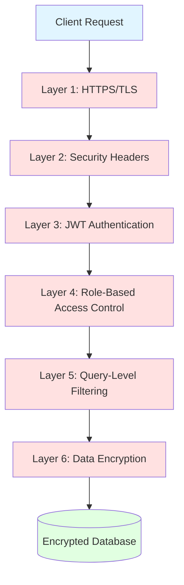
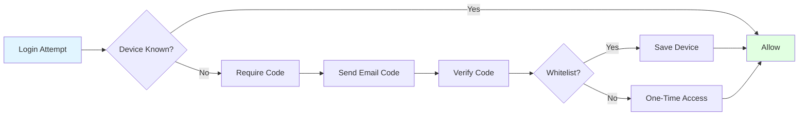

# SECURITY

## Overview

The WORM API implements comprehensive security measures across multiple layers to protect data, authenticate users, and prevent unauthorized access. This document details all security features, encryption methods, threat mitigation strategies, and best practices.

**Security Principles**:
- **Defense in Depth**: Multiple security layers
- **Least Privilege**: Minimal access rights
- **Fail Secure**: Default deny on errors
- **Separation of Concerns**: Isolated security components
- **Audit Trail**: Comprehensive logging

---

## Security Architecture

### Multi-Layer Defense



---

## Encryption

### AES-256-GCM Encryption

**Implementation**: [`utils/util-encryption.js`](utils/util-encryption.js:47)

The API uses AES-256-GCM (Galois/Counter Mode) for authenticated encryption, providing both confidentiality and integrity.

#### Encryption Process

```javascript
async function aes_256_gcm_encrypt(password, input) {
  // 1. Generate random IV (Initialization Vector)
  // Never reuse an IV with the same key
  const iv = crypto.randomBytes(16);
  
  // 2. Generate random salt for key derivation
  const salt = crypto.randomBytes(16);
  
  // 3. Derive secure 32-byte key using Scrypt
  const key = await new Promise((resolve, reject) => {
    crypto.scrypt(password, salt, 32, (err, derivedKey) => {
      if (err) reject(err);
      else resolve(derivedKey);
    });
  });
  
  // 4. Create cipher in GCM mode
  const cipher = crypto.createCipheriv('aes-256-gcm', key, iv);
  
  // 5. Encrypt data
  let encrypted = '';
  cipher.setEncoding('hex');
  
  await pipeline(
    Readable.from([input]),
    cipher,
    async function* (source) {
      for await (const chunk of source) {
        encrypted += chunk;
      }
    }
  );
  
  // 6. Get authentication tag (proves data integrity)
  const authTag = cipher.getAuthTag().toString('hex');
  
  // 7. Return all components needed for decryption
  return {
    encrypted,
    iv: iv.toString('hex'),
    salt: salt.toString('hex'),
    authTag
  };
}
```

**Key Features**:
- **256-bit key length**: Maximum security strength
- **Galois/Counter Mode**: Authenticated encryption (AEAD)
- **Random IV**: Unique per encryption operation
- **Authentication Tag**: Detects tampering
- **Scrypt KDF**: Memory-hard key derivation

#### Decryption Process

```javascript
async function aes_256_gcm_decrypt(password, { encrypted, iv, salt, authTag }) {
  // 1. Derive the same key using provided salt
  const key = await new Promise((resolve, reject) => {
    crypto.scrypt(password, Buffer.from(salt, 'hex'), 32, (err, derivedKey) => {
      if (err) reject(err);
      else resolve(derivedKey);
    });
  });
  
  // 2. Create decipher
  const decipher = crypto.createDecipheriv(
    'aes-256-gcm',
    key,
    Buffer.from(iv, 'hex')
  );
  
  // 3. Set authentication tag
  // If data was tampered with, this will throw an error
  decipher.setAuthTag(Buffer.from(authTag, 'hex'));
  
  // 4. Decrypt data
  let decrypted = '';
  decipher.setEncoding('utf8');
  
  await pipeline(
    Readable.from(Buffer.from(encrypted, 'hex')),
    decipher,
    async function* (source) {
      for await (const chunk of source) {
        decrypted += chunk;
      }
    }
  );
  
  return decrypted;
}
```

**Security Properties**:
- **Integrity**: Authentication tag ensures data wasn't modified
- **Confidentiality**: Strong encryption protects data
- **Authenticity**: Verifies data came from legitimate source
- **Non-malleability**: Tampering is detected

### SHA-256 Hashing

**Implementation**: [`utils/util-encryption.js`](utils/util-encryption.js:135)

SHA-256 is used for password hashing and data integrity verification.

```javascript
function sha256_hash(key) {
  return new Promise((resolve, reject) => {
    try {
      const hash = crypto.createHash('sha256');
      hash.on('readable', () => {
        const data = hash.read();
        if (data) {
          return resolve(data.toString('hex'));
        }
      });
      hash.write(key);
      hash.end();
    } catch (e) {
      return reject(e);
    }
  });
}
```

**Use Cases**:
- Password hashing before salting
- Deriving encryption keys
- Data integrity checksums
- Token generation

**Properties**:
- **One-way**: Cannot be reversed
- **Deterministic**: Same input = same output
- **Fast computation**: Efficient verification
- **Collision resistant**: Practically impossible to find two inputs with same hash

### Scrypt Key Derivation

**Purpose**: Convert passwords into cryptographic keys

**Why Scrypt**:
- **Memory-hard**: Resistant to GPU/ASIC attacks
- **Time-consuming**: Slows down brute force attempts
- **Adjustable cost**: Can increase difficulty over time

**Configuration**:
```javascript
// Scrypt parameters
const N = 32768;  // CPU/memory cost (2^15)
const r = 8;       // Block size
const p = 1;       // Parallelization
const keyLength = 32; // Output length (256 bits)

crypto.scrypt(password, salt, keyLength, { N, r, p }, callback);
```

---

## Password Security

### User-Specific Salt

**Implementation**: [`utils/util-auth.js`](utils/util-auth.js:43)

Each user has a unique, deterministic salt based on their ID and creation timestamp:

```javascript
async function salt(userId, createdAt, data) {
  // Generate unique salt components
  const date = +new Date(createdAt);
  const multiplier = Math.pow(userId, 69);
  const combined = '' + Math.sqrt(multiplier * date);
  
  // Derive encryption key from salt
  const key = await sha256_hash(combined);
  
  // Encrypt data with user's unique key
  return await aes_256_gcm_encrypt(key, data);
}
```

**Security Benefits**:
1. **Unique Per User**: Same password → different encrypted values
2. **Deterministic**: Can always recreate the salt for validation
3. **Non-Transferable**: Salt tied to user's identity
4. **Rainbow Table Resistant**: Precomputed tables useless

**Example**:
```javascript
// User 1 (ID: 1, created: 2024-01-01)
Password: "Secret123!@#"
Salt: "abc123..." (derived from ID=1, date=2024-01-01)
Encrypted: "e3f9a7b2..."

// User 2 (ID: 2, created: 2024-01-01)  
Password: "Secret123!@#" (same password!)
Salt: "xyz789..." (different - derived from ID=2)
Encrypted: "d8c4e1f5..." (completely different)
```

### Password Complexity Rules

**Implementation**: [`utils/util-auth.js`](utils/util-auth.js:12)

```javascript
const rules = {
  minLength: 15,
  minUppercase: 2,
  minLowercase: 2,
  minNumbers: 2,
  minSpecialChars: 2,
  allowedSpecialChars: ['~', '`', '!', '@', '#', '$', '€', '%', '^', '&', '*', 
                        '(', ')', '-', '_', '+', '=', '{', '}', '[', ']', '|', 
                        '\\', '/', ':', ';', '"', "'", '<', '>', ',', '.', '?']
};
```

**Rationale**:
- **15+ characters**: Increases entropy significantly
- **2+ uppercase**: Prevents simple lowercase passwords
- **2+ numbers**: Adds numeric complexity
- **2+ special chars**: Maximum character set diversity

**Strength Comparison**:
| Password | Entropy | Crack Time (10B/s) |
|----------|---------|-------------------|
| `password` | 37 bits | < 1 second |
| `Password1!` | 59 bits | 18 years |
| `MySecure123!@#` | 87 bits | 4.9 trillion years |

### Password History

**Implementation**: [`models/db/password_history.js`](models/db/password_history.js:1)

Tracks last N passwords to prevent reuse:

```javascript
// Check if password was used in last 5 passwords
const history = await db.password_history.find({
  user_id: userId
})
.sort('createdAt DESC')
.limit(5);

for (const record of history) {
  if (record.password === newSaltedPassword) {
    throw new Error('Password was used recently');
  }
}
```

**Security Benefits**:
- Prevents password cycling
- Forces true password changes
- Tracks password age
- Configurable lookback period

---

## Authentication Security

### JWT Token Security

**Token Structure**:
```javascript
{
  "header": {
    "alg": "HS256",
    "typ": "JWT"
  },
  "payload": {
    "id": 1,
    "email": "user@example.com",
    "roles": 2,
    "type": "user",
    "iat": 1640000000,
    "exp": 1640003600
  },
  "signature": "..." // HMAC-SHA256(header + payload, JWT_SECRET)
}
```

**Security Measures**:
1. **HMAC-SHA256 Signature**: Prevents token tampering
2. **Short Expiry**: Default 60 minutes
3. **Secret Key**: Strong, random, never exposed
4. **No Sensitive Data**: Only IDs and roles
5. **Database Verification**: Token existence checked

### Device Verification

**Flow**:


**Security Benefits**:
- Detects unauthorized access from new devices
- Requires email verification for unknown devices
- Optional device whitelisting
- Audit trail of device additions

### Brute Force Protection

**Progressive Lockout**:

| Attempts | Lockout Duration | Action |
|----------|-----------------|--------|
| 1-2 | None | Warning logged |
| 3-5 | 5 minutes | Email notification |
| 6-8 | 30 minutes | Urgent email notification |
| 9+ | Permanent | Account inactivation, admin intervention required |

**Implementation Details**:
```javascript
// Check lockout status
if (attempts >= 3 && attempts < 6) {
  const lockoutUntil = new Date(lastAttempt.getTime() + 5 * 60 * 1000);
  if (now < lockoutUntil) {
    return { error: 'User blocked until ' + lockoutUntil };
  }
}
```

**Security Benefits**:
- Prevents automated brute force attacks
- Rate limits password guessing
- Alerts user of suspicious activity
- Escalating consequences

---

## Authorization Security

### Role-Based Access Control (RBAC)

**Permission Matrix**: [`config/permissions.js`](config/permissions.js:1)

```javascript
const permissions = {
  1: { // Admin
    name: 'admin',
    permissions: {
      users: ['read', 'write', 'delete', 'read_sensitive'],
      roles: ['read', 'write', 'delete'],
      sessions: ['read', 'delete']
    }
  },
  2: { // User
    name: 'user',
    permissions: {
      users: ['read', 'write'], // Own data only
      roles: ['read']
    }
  }
};
```

**Security Enforcement**:
1. **Token Validation**: Every request validated
2. **Permission Check**: Role permissions verified
3. **Query Adaptation**: Automatic data filtering
4. **Response Filtering**: Sensitive data removed

### Query-Level Security

**Automatic Data Filtering**:

```javascript
// User with role 'user' (ID: 5) requests: GET /generic/users
// Original query: SELECT * FROM users

// Adapted query: SELECT * FROM users WHERE id = 5
// User only sees their own data

// Admin with role 'admin' requests: GET /generic/users  
// Original query: SELECT * FROM users
// No adaptation - admin sees all data
```

**Benefits**:
- Prevents unauthorized data access
- Enforced at query level (database)
- Cannot be bypassed client-side
- Transparent to application code

---

## Network Security

### HTTPS/TLS

**Production Requirements**:
```javascript
// Force HTTPS in production
if (process.env.NODE_ENV === 'production') {
  app.use((req, res, next) => {
    if (!req.secure && req.get('x-forwarded-proto') !== 'https') {
      return res.redirect('https://' + req.get('host') + req.url);
    }
    next();
  });
}
```

**TLS Configuration**:
- **Minimum Version**: TLS 1.2
- **Cipher Suites**: Strong ciphers only
- **Certificate**: Valid SSL/TLS certificate
- **HSTS**: HTTP Strict Transport Security enabled

### Security Headers

**Helmet Configuration**: [`api/api.js`](api/api.js:1)

```javascript
app.use(helmet({
  contentSecurityPolicy: {
    directives: {
      defaultSrc: ["'self'"],
      styleSrc: ["'self'", "'unsafe-inline'"],
      scriptSrc: ["'self'"],
      imgSrc: ["'self'", "", "https:"]
    }
  },
  hsts: {
    maxAge: 31536000,        // 1 year
    includeSubDomains: true,
    preload: true
  },
  frameguard: {
    action: 'deny'
  },
  noSniff: true,
  xssFilter: true
}));
```

**Headers Applied**:
- **Content-Security-Policy**: Restricts resource loading
- **Strict-Transport-Security**: Forces HTTPS
- **X-Frame-Options**: Prevents clickjacking
- **X-Content-Type-Options**: Prevents MIME sniffing
- **X-XSS-Protection**: Browser XSS filter

**See Also**:
- [`AUTHENTICATION.md`](AUTHENTICATION.md) - Authentication implementation
- [`PERMISSIONS.md`](PERMISSIONS.md) - Authorization details
- [`CONFIGURATION.md`](CONFIGURATION.md) - Security configuration
- [`DATABASE.md`](DATABASE.md) - Data protection